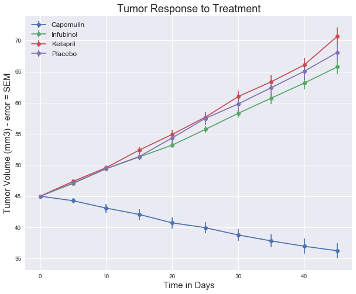
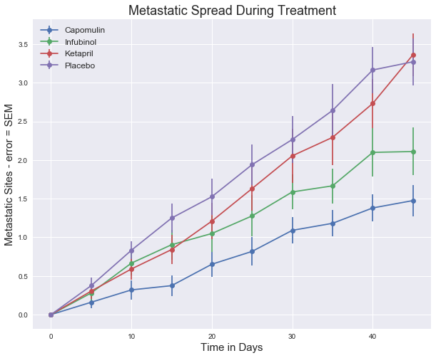
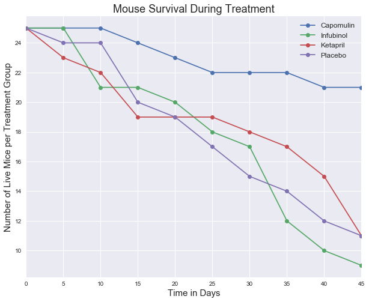
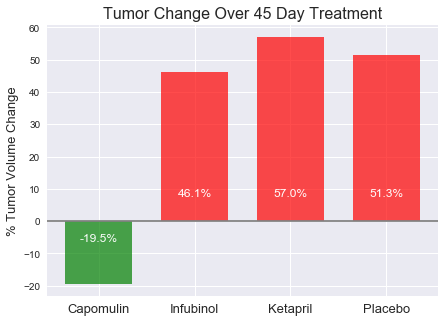

<h1>Pymaceuticals</h1>
</hr>
<h2>Overall Analysis</h2>
<ol><li>Capomulin had the highest rate of mouse survial</li>
<li>Capomulin was the only treatment observed to show a reduction in tumor size; other treatments showed results similar to placebo</li>
<li>It is not clear whether any treatment had a statistically significant reduction in metastatic spread. A t-test comparing treatments vs. placebo would likely be needed to make a conclusion on that.</li></ol>


```python
#import dependencies

%matplotlib inline
import os
import numpy as np
import pandas as pd
import matplotlib.pyplot as plt
import seaborn as sns
sns.set() #switching on seaborn defaults to make the graph look pretty
```


```python
#import our two csv files
drug_path = os.path.join('mouse_drug_data.csv')
trial_path = os.path.join('clinicaltrial_data.csv')
drug_df = pd.read_csv(drug_path)
trial_df = pd.read_csv(trial_path)
```


```python
#inspect the files
trial_df.dtypes
trial_df.count()
trial_df.head()
trial_df.Timepoint.unique()
```


    array([ 0,  5, 10, 15, 20, 25, 30, 35, 40, 45], dtype=int64)


```python
drug_df.dtypes
drug_df.count()
drug_df.head()

```


<div>
<style>
    .dataframe thead tr:only-child th {
        text-align: right;
    }

    .dataframe thead th {
        text-align: left;
    }

    .dataframe tbody tr th {
        vertical-align: top;
    }
</style>
<table border="1" class="dataframe">
  <thead>
    <tr style="text-align: right;">
      <th></th>
      <th>Mouse ID</th>
      <th>Drug</th>
    </tr>
  </thead>
  <tbody>
    <tr>
      <th>0</th>
      <td>f234</td>
      <td>Stelasyn</td>
    </tr>
    <tr>
      <th>1</th>
      <td>x402</td>
      <td>Stelasyn</td>
    </tr>
    <tr>
      <th>2</th>
      <td>a492</td>
      <td>Stelasyn</td>
    </tr>
    <tr>
      <th>3</th>
      <td>w540</td>
      <td>Stelasyn</td>
    </tr>
    <tr>
      <th>4</th>
      <td>v764</td>
      <td>Stelasyn</td>
    </tr>
  </tbody>
</table>
</div>


```python
#merge the two dataframes
df = pd.merge(trial_df, drug_df, how='inner')
df.count()
df.head()
```


<div>
<style>
    .dataframe thead tr:only-child th {
        text-align: right;
    }

    .dataframe thead th {
        text-align: left;
    }

    .dataframe tbody tr th {
        vertical-align: top;
    }
</style>
<table border="1" class="dataframe">
  <thead>
    <tr style="text-align: right;">
      <th></th>
      <th>Mouse ID</th>
      <th>Timepoint</th>
      <th>Tumor Volume (mm3)</th>
      <th>Metastatic Sites</th>
      <th>Drug</th>
    </tr>
  </thead>
  <tbody>
    <tr>
      <th>0</th>
      <td>b128</td>
      <td>0</td>
      <td>45.000000</td>
      <td>0</td>
      <td>Capomulin</td>
    </tr>
    <tr>
      <th>1</th>
      <td>b128</td>
      <td>5</td>
      <td>45.651331</td>
      <td>0</td>
      <td>Capomulin</td>
    </tr>
    <tr>
      <th>2</th>
      <td>b128</td>
      <td>10</td>
      <td>43.270852</td>
      <td>0</td>
      <td>Capomulin</td>
    </tr>
    <tr>
      <th>3</th>
      <td>b128</td>
      <td>15</td>
      <td>43.784893</td>
      <td>0</td>
      <td>Capomulin</td>
    </tr>
    <tr>
      <th>4</th>
      <td>b128</td>
      <td>20</td>
      <td>42.731552</td>
      <td>0</td>
      <td>Capomulin</td>
    </tr>
  </tbody>
</table>
</div>


<h3>Scatter Plot of tumor response to treatment</h3>


```python
#Creat a scatter plot of tumor volume changing over time with each treatment
#we will need to group by treatment, and then take the mean of each tumor value per timepoint for each treatment and plot that.

drug_groups = df.groupby(['Drug', 'Timepoint'])
drug_groups_df = pd.DataFrame({'Tumor Volume': drug_groups['Tumor Volume (mm3)'].mean()})
drug_groups_df = drug_groups_df.sort_index()
drug_groups_df.head()

```


<div>
<style>
    .dataframe thead tr:only-child th {
        text-align: right;
    }

    .dataframe thead th {
        text-align: left;
    }

    .dataframe tbody tr th {
        vertical-align: top;
    }
</style>
<table border="1" class="dataframe">
  <thead>
    <tr style="text-align: right;">
      <th></th>
      <th></th>
      <th>Tumor Volume</th>
    </tr>
    <tr>
      <th>Drug</th>
      <th>Timepoint</th>
      <th></th>
    </tr>
  </thead>
  <tbody>
    <tr>
      <th rowspan="5" valign="top">Capomulin</th>
      <th>0</th>
      <td>45.000000</td>
    </tr>
    <tr>
      <th>5</th>
      <td>44.266086</td>
    </tr>
    <tr>
      <th>10</th>
      <td>43.084291</td>
    </tr>
    <tr>
      <th>15</th>
      <td>42.064317</td>
    </tr>
    <tr>
      <th>20</th>
      <td>40.716325</td>
    </tr>
  </tbody>
</table>
</div>


```python
#turn each drug group into a series to be able to plot. Timepoints should be the index to this dataframe
#Can we use .loc to grab only the results from a specific drug?

cap = drug_groups_df.loc['Capomulin', :]
cap

#get a list of all the drugs
#drugs = df.groupby('Drug')
#drug_list_df = pd.DataFrame({'Tumor Volume': drugs['Tumor Volume (mm3)'].mean()})
drugs = df.Drug.unique()
drug_list = sorted(drugs)
drug_list
```


    ['Capomulin',
     'Ceftamin',
     'Infubinol',
     'Ketapril',
     'Naftisol',
     'Placebo',
     'Propriva',
     'Ramicane',
     'Stelasyn',
     'Zoniferol']


```python
#find SEM for both tumor volume and # of metastatic sites

tumor_sem = drug_groups['Tumor Volume (mm3)'].sem()
tumor_sem = pd.DataFrame(tumor_sem)
meta_sem = drug_groups['Metastatic Sites'].sem()
meta_sem = pd.DataFrame(meta_sem)
test = meta_sem['Metastatic Sites'].loc['Capomulin',:]
test
```


    Drug       Timepoint
    Capomulin  0            0.000000
               5            0.074833
               10           0.125433
               15           0.132048
               20           0.161621
               25           0.181818
               30           0.172944
               35           0.169496
               40           0.175610
               45           0.202591
    Name: Metastatic Sites, dtype: float64


```python
#get sem for one drug (to test and see if we can use later)  
    
capomulin_t_sem = tumor_sem['Tumor Volume (mm3)'].loc['Capomulin',:]  
capomulin_t_sem
```


    Drug       Timepoint
    Capomulin  0            0.000000
               5            0.448593
               10           0.702684
               15           0.838617
               20           0.909731
               25           0.881642
               30           0.934460
               35           1.052241
               40           1.223608
               45           1.223977
    Name: Tumor Volume (mm3), dtype: float64


```python
#create a timepoint index to be used for a later dataframe
cap = drug_groups_df.loc['Capomulin', :]
cap = pd.DataFrame(cap)
cap
```


<div>
<style>
    .dataframe thead tr:only-child th {
        text-align: right;
    }

    .dataframe thead th {
        text-align: left;
    }

    .dataframe tbody tr th {
        vertical-align: top;
    }
</style>
<table border="1" class="dataframe">
  <thead>
    <tr style="text-align: right;">
      <th></th>
      <th>Tumor Volume</th>
    </tr>
    <tr>
      <th>Timepoint</th>
      <th></th>
    </tr>
  </thead>
  <tbody>
    <tr>
      <th>0</th>
      <td>45.000000</td>
    </tr>
    <tr>
      <th>5</th>
      <td>44.266086</td>
    </tr>
    <tr>
      <th>10</th>
      <td>43.084291</td>
    </tr>
    <tr>
      <th>15</th>
      <td>42.064317</td>
    </tr>
    <tr>
      <th>20</th>
      <td>40.716325</td>
    </tr>
    <tr>
      <th>25</th>
      <td>39.939528</td>
    </tr>
    <tr>
      <th>30</th>
      <td>38.769339</td>
    </tr>
    <tr>
      <th>35</th>
      <td>37.816839</td>
    </tr>
    <tr>
      <th>40</th>
      <td>36.958001</td>
    </tr>
    <tr>
      <th>45</th>
      <td>36.236114</td>
    </tr>
  </tbody>
</table>
</div>


```python
#create a new dataframe with our drug names as column names
df_by_drug = pd.DataFrame(index=cap.index)
    
for drug in drug_list:
    df_by_drug[drug] = drug_groups_df.loc[drug, :]
    
df_by_drug.head()
```


<div>
<style>
    .dataframe thead tr:only-child th {
        text-align: right;
    }

    .dataframe thead th {
        text-align: left;
    }

    .dataframe tbody tr th {
        vertical-align: top;
    }
</style>
<table border="1" class="dataframe">
  <thead>
    <tr style="text-align: right;">
      <th></th>
      <th>Capomulin</th>
      <th>Ceftamin</th>
      <th>Infubinol</th>
      <th>Ketapril</th>
      <th>Naftisol</th>
      <th>Placebo</th>
      <th>Propriva</th>
      <th>Ramicane</th>
      <th>Stelasyn</th>
      <th>Zoniferol</th>
    </tr>
    <tr>
      <th>Timepoint</th>
      <th></th>
      <th></th>
      <th></th>
      <th></th>
      <th></th>
      <th></th>
      <th></th>
      <th></th>
      <th></th>
      <th></th>
    </tr>
  </thead>
  <tbody>
    <tr>
      <th>0</th>
      <td>45.000000</td>
      <td>45.000000</td>
      <td>45.000000</td>
      <td>45.000000</td>
      <td>45.000000</td>
      <td>45.000000</td>
      <td>45.000000</td>
      <td>45.000000</td>
      <td>45.000000</td>
      <td>45.000000</td>
    </tr>
    <tr>
      <th>5</th>
      <td>44.266086</td>
      <td>46.503051</td>
      <td>47.062001</td>
      <td>47.389175</td>
      <td>46.796098</td>
      <td>47.125589</td>
      <td>47.248967</td>
      <td>43.944859</td>
      <td>47.527452</td>
      <td>46.851818</td>
    </tr>
    <tr>
      <th>10</th>
      <td>43.084291</td>
      <td>48.285125</td>
      <td>49.403909</td>
      <td>49.582269</td>
      <td>48.694210</td>
      <td>49.423329</td>
      <td>49.101541</td>
      <td>42.531957</td>
      <td>49.463844</td>
      <td>48.689881</td>
    </tr>
    <tr>
      <th>15</th>
      <td>42.064317</td>
      <td>50.094055</td>
      <td>51.296397</td>
      <td>52.399974</td>
      <td>50.933018</td>
      <td>51.359742</td>
      <td>51.067318</td>
      <td>41.495061</td>
      <td>51.529409</td>
      <td>50.779059</td>
    </tr>
    <tr>
      <th>20</th>
      <td>40.716325</td>
      <td>52.157049</td>
      <td>53.197691</td>
      <td>54.920935</td>
      <td>53.644087</td>
      <td>54.364417</td>
      <td>53.346737</td>
      <td>40.238325</td>
      <td>54.067395</td>
      <td>53.170334</td>
    </tr>
  </tbody>
</table>
</div>


```python
plt.figure(figsize=(10,8))
plt.errorbar(x=df_by_drug.index, y=df_by_drug.Capomulin, yerr=capomulin_t_sem, marker='o')
plt.errorbar(x=df_by_drug.index, y=df_by_drug.Infubinol, yerr=tumor_sem['Tumor Volume (mm3)'].loc['Infubinol',:] , marker='o')
plt.errorbar(x=df_by_drug.index, y=df_by_drug.Ketapril, yerr=tumor_sem['Tumor Volume (mm3)'].loc['Ketapril',:] , marker='o')
plt.errorbar(x=df_by_drug.index, y=df_by_drug.Placebo, yerr=tumor_sem['Tumor Volume (mm3)'].loc['Placebo',:] , marker='o')
plt.legend(prop={'size': 12})
plt.title('Tumor Response to Treatment', fontsize=18)
plt.xlabel('Time in Days', fontsize=15)
plt.ylabel('Tumor Volume (mm3) - error = SEM', fontsize=15)
```


    Text(0,0.5,'Tumor Volume (mm3) - error = SEM')





<h3>Scatter Plot of metastatic response to treatment</h3>


```python
#repeat the process of the dataframe but for metastatic response

meta_df = df.groupby(['Drug', 'Timepoint'])
meta_df = pd.DataFrame({'Metastatic Sites': drug_groups['Metastatic Sites'].mean()})
meta_df = meta_df.sort_index()
```


```python
metastatic_df = pd.DataFrame(index=cap.index)
    
for drug in drug_list:
    metastatic_df[drug] = meta_df.loc[drug, :]
    
metastatic_df.head()
```


<div>
<style>
    .dataframe thead tr:only-child th {
        text-align: right;
    }

    .dataframe thead th {
        text-align: left;
    }

    .dataframe tbody tr th {
        vertical-align: top;
    }
</style>
<table border="1" class="dataframe">
  <thead>
    <tr style="text-align: right;">
      <th></th>
      <th>Capomulin</th>
      <th>Ceftamin</th>
      <th>Infubinol</th>
      <th>Ketapril</th>
      <th>Naftisol</th>
      <th>Placebo</th>
      <th>Propriva</th>
      <th>Ramicane</th>
      <th>Stelasyn</th>
      <th>Zoniferol</th>
    </tr>
    <tr>
      <th>Timepoint</th>
      <th></th>
      <th></th>
      <th></th>
      <th></th>
      <th></th>
      <th></th>
      <th></th>
      <th></th>
      <th></th>
      <th></th>
    </tr>
  </thead>
  <tbody>
    <tr>
      <th>0</th>
      <td>0.000000</td>
      <td>0.000000</td>
      <td>0.000000</td>
      <td>0.000000</td>
      <td>0.000000</td>
      <td>0.000000</td>
      <td>0.000000</td>
      <td>0.000000</td>
      <td>0.000000</td>
      <td>0.000000</td>
    </tr>
    <tr>
      <th>5</th>
      <td>0.160000</td>
      <td>0.380952</td>
      <td>0.280000</td>
      <td>0.304348</td>
      <td>0.260870</td>
      <td>0.375000</td>
      <td>0.320000</td>
      <td>0.120000</td>
      <td>0.240000</td>
      <td>0.166667</td>
    </tr>
    <tr>
      <th>10</th>
      <td>0.320000</td>
      <td>0.600000</td>
      <td>0.666667</td>
      <td>0.590909</td>
      <td>0.523810</td>
      <td>0.833333</td>
      <td>0.565217</td>
      <td>0.250000</td>
      <td>0.478261</td>
      <td>0.500000</td>
    </tr>
    <tr>
      <th>15</th>
      <td>0.375000</td>
      <td>0.789474</td>
      <td>0.904762</td>
      <td>0.842105</td>
      <td>0.857143</td>
      <td>1.250000</td>
      <td>0.764706</td>
      <td>0.333333</td>
      <td>0.782609</td>
      <td>0.809524</td>
    </tr>
    <tr>
      <th>20</th>
      <td>0.652174</td>
      <td>1.111111</td>
      <td>1.050000</td>
      <td>1.210526</td>
      <td>1.150000</td>
      <td>1.526316</td>
      <td>1.000000</td>
      <td>0.347826</td>
      <td>0.952381</td>
      <td>1.294118</td>
    </tr>
  </tbody>
</table>
</div>


```python
plt.figure(figsize=(10,8))
plt.errorbar(x=metastatic_df.index, y=metastatic_df.Capomulin, yerr=meta_sem['Metastatic Sites'].loc['Capomulin',:] , marker='o')
plt.errorbar(x=metastatic_df.index, y=metastatic_df.Infubinol, yerr=meta_sem['Metastatic Sites'].loc['Infubinol',:] , marker='o')
plt.errorbar(x=metastatic_df.index, y=metastatic_df.Ketapril, yerr=meta_sem['Metastatic Sites'].loc['Ketapril',:] , marker='o')
plt.errorbar(x=metastatic_df.index, y=metastatic_df.Placebo, yerr=meta_sem['Metastatic Sites'].loc['Placebo',:] , marker='o')
plt.legend(prop={'size': 12})
plt.title('Metastatic Spread During Treatment', fontsize=18)
plt.xlabel('Time in Days', fontsize=15)
plt.ylabel('Metastatic Sites - error = SEM', fontsize=15)
```


    Text(0,0.5,'Metastatic Sites - error = SEM')





<h3>Scatter plot of Survival Rate (mice alive through treatment)</h3>


```python
#we want a count of mice per treatment at different timepoints
#group by treatment and timepoint, and then get a count of mice

mice = pd.DataFrame({'Living Mice': drug_groups['Mouse ID'].count()})
mice.head()
```


<div>
<style>
    .dataframe thead tr:only-child th {
        text-align: right;
    }

    .dataframe thead th {
        text-align: left;
    }

    .dataframe tbody tr th {
        vertical-align: top;
    }
</style>
<table border="1" class="dataframe">
  <thead>
    <tr style="text-align: right;">
      <th></th>
      <th></th>
      <th>Living Mice</th>
    </tr>
    <tr>
      <th>Drug</th>
      <th>Timepoint</th>
      <th></th>
    </tr>
  </thead>
  <tbody>
    <tr>
      <th rowspan="5" valign="top">Capomulin</th>
      <th>0</th>
      <td>25</td>
    </tr>
    <tr>
      <th>5</th>
      <td>25</td>
    </tr>
    <tr>
      <th>10</th>
      <td>25</td>
    </tr>
    <tr>
      <th>15</th>
      <td>24</td>
    </tr>
    <tr>
      <th>20</th>
      <td>23</td>
    </tr>
  </tbody>
</table>
</div>


```python
#pivot the df

mice_df = pd.DataFrame(index=cap.index)
    
for drug in drug_list:
    mice_df[drug] = mice.loc[drug, :]
    
mice_df.head()
```


<div>
<style>
    .dataframe thead tr:only-child th {
        text-align: right;
    }

    .dataframe thead th {
        text-align: left;
    }

    .dataframe tbody tr th {
        vertical-align: top;
    }
</style>
<table border="1" class="dataframe">
  <thead>
    <tr style="text-align: right;">
      <th></th>
      <th>Capomulin</th>
      <th>Ceftamin</th>
      <th>Infubinol</th>
      <th>Ketapril</th>
      <th>Naftisol</th>
      <th>Placebo</th>
      <th>Propriva</th>
      <th>Ramicane</th>
      <th>Stelasyn</th>
      <th>Zoniferol</th>
    </tr>
    <tr>
      <th>Timepoint</th>
      <th></th>
      <th></th>
      <th></th>
      <th></th>
      <th></th>
      <th></th>
      <th></th>
      <th></th>
      <th></th>
      <th></th>
    </tr>
  </thead>
  <tbody>
    <tr>
      <th>0</th>
      <td>25</td>
      <td>25</td>
      <td>25</td>
      <td>25</td>
      <td>25</td>
      <td>25</td>
      <td>26</td>
      <td>25</td>
      <td>26</td>
      <td>25</td>
    </tr>
    <tr>
      <th>5</th>
      <td>25</td>
      <td>21</td>
      <td>25</td>
      <td>23</td>
      <td>23</td>
      <td>24</td>
      <td>25</td>
      <td>25</td>
      <td>25</td>
      <td>24</td>
    </tr>
    <tr>
      <th>10</th>
      <td>25</td>
      <td>20</td>
      <td>21</td>
      <td>22</td>
      <td>21</td>
      <td>24</td>
      <td>23</td>
      <td>24</td>
      <td>23</td>
      <td>22</td>
    </tr>
    <tr>
      <th>15</th>
      <td>24</td>
      <td>19</td>
      <td>21</td>
      <td>19</td>
      <td>21</td>
      <td>20</td>
      <td>17</td>
      <td>24</td>
      <td>23</td>
      <td>21</td>
    </tr>
    <tr>
      <th>20</th>
      <td>23</td>
      <td>18</td>
      <td>20</td>
      <td>19</td>
      <td>20</td>
      <td>19</td>
      <td>17</td>
      <td>23</td>
      <td>21</td>
      <td>17</td>
    </tr>
  </tbody>
</table>
</div>


```python
select_mice = mice_df[['Capomulin', 'Infubinol', 'Ketapril', 'Placebo']]
select_mice.plot(figsize=(10,8), marker='o')
plt.title('Mouse Survival During Treatment', fontsize=18)
plt.xlabel('Time in Days', fontsize=15)
plt.ylabel('Number of Live Mice per Treatment Group', fontsize=15)
plt.legend(prop={'size': 12})
```


    <matplotlib.legend.Legend at 0x1d0c3563128>





<h3>Create a summary bar graph of % tumor volume change for target drugs</h3>


```python
#also make sure to include a label on each bar with the perent change

#first, calculate %change in tumor size for each treatment

percent = pd.DataFrame((df_by_drug.iloc[9,:] / df_by_drug.iloc[0,:]) *100 - 100)
```


<div>
<style>
    .dataframe thead tr:only-child th {
        text-align: right;
    }

    .dataframe thead th {
        text-align: left;
    }

    .dataframe tbody tr th {
        vertical-align: top;
    }
</style>
<table border="1" class="dataframe">
  <thead>
    <tr style="text-align: right;">
      <th></th>
      <th>0</th>
    </tr>
  </thead>
  <tbody>
    <tr>
      <th>Capomulin</th>
      <td>-19.475303</td>
    </tr>
    <tr>
      <th>Ceftamin</th>
      <td>42.516492</td>
    </tr>
    <tr>
      <th>Infubinol</th>
      <td>46.123472</td>
    </tr>
    <tr>
      <th>Ketapril</th>
      <td>57.028795</td>
    </tr>
    <tr>
      <th>Naftisol</th>
      <td>53.923347</td>
    </tr>
    <tr>
      <th>Placebo</th>
      <td>51.297960</td>
    </tr>
    <tr>
      <th>Propriva</th>
      <td>47.241175</td>
    </tr>
    <tr>
      <th>Ramicane</th>
      <td>-22.320900</td>
    </tr>
    <tr>
      <th>Stelasyn</th>
      <td>52.085134</td>
    </tr>
    <tr>
      <th>Zoniferol</th>
      <td>46.579751</td>
    </tr>
  </tbody>
</table>
</div>


```python
percent_df = pd.DataFrame({
    'Capomulin': percent.iloc[0], 
    'Infubinol': percent.iloc[2], 
    'Ketapril': percent.iloc[3], 
    'Placebo': percent.iloc[5]})
percent_df
```


<div>
<style>
    .dataframe thead tr:only-child th {
        text-align: right;
    }

    .dataframe thead th {
        text-align: left;
    }

    .dataframe tbody tr th {
        vertical-align: top;
    }
</style>
<table border="1" class="dataframe">
  <thead>
    <tr style="text-align: right;">
      <th></th>
      <th>Capomulin</th>
      <th>Infubinol</th>
      <th>Ketapril</th>
      <th>Placebo</th>
    </tr>
  </thead>
  <tbody>
    <tr>
      <th>0</th>
      <td>-19.475303</td>
      <td>46.123472</td>
      <td>57.028795</td>
      <td>51.29796</td>
    </tr>
  </tbody>
</table>
</div>


```python
x=np.arange(0,4)
y=percent_df.iloc[0]
tick_locations=np.arange(0,4)
treatments=['Capomulin', 'Infubinol', 'Ketapril', 'Placebo']
my_color=np.where(y>=0, 'red', 'green')

#plt.figure(figsize=(8,8))
fig, ax = plt.subplots(figsize=(7,5))
rects = ax.bar(x, y, 0.7, color=my_color, alpha=0.7)

ax.set_xticks(tick_locations)
ax.set_xticklabels(treatments, fontsize=13)
ax.set_ylabel('% Tumor Volume Change', fontsize=13)
ax.set_title('Tumor Change Over 45 Day Treatment', fontsize=16)
ax.axhline(y=0, color='grey')

labels = percent_df.iloc[0].round(1).map("{:,.1f}%".format)

for rect, label in zip(rects, labels):
    if rect.get_height() > 0: 
        height = 7
    else: 
        height = -7
    ax.text(rect.get_x() + rect.get_width() / 2, height, label, ha='center', va='bottom', color='white')

#ax.text(percent_df.iloc[0], y=0, s=1)
 
plt.show()
```




