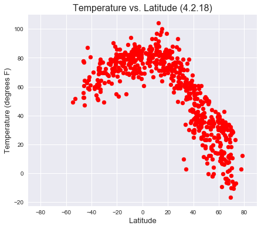
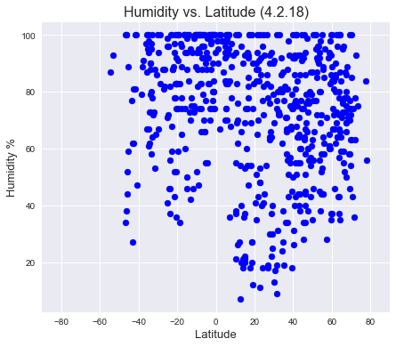
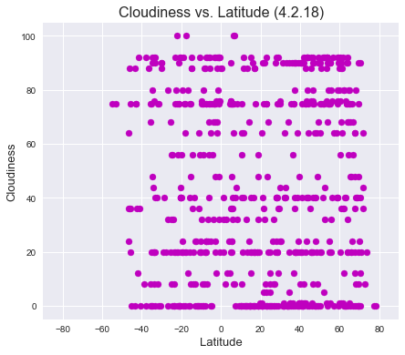
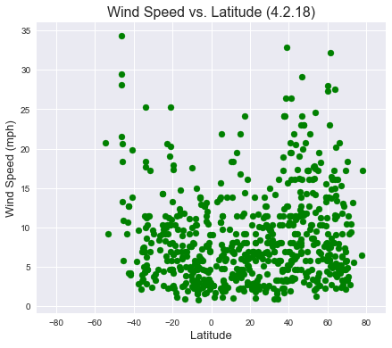

## Three Observations from Reviewing the Data:
1. The Temperature data shows a clear peak near the equator, and a precipitous drop in temperature as latitude increases (average temperature hits freezing at about 45 degrees latitude.)
2. There appears to be no correlation between latitude and cloudiness or wind speed.
3. The data show the limited land in the southern hemisphere of the Earth compared to the northern hemisphere - with very little inhabited land below -50 degrees of latitude.


```python
import numpy as np
import pandas as pd
import matplotlib.pyplot as plt
import seaborn as sns
from citipy import citipy
from config import api_key
import requests
sns.set()
```


```python
#create a list of latitude and longitude. We expect that when fed to citipy, some will return the same city.
#Some of these cities may also return a "no city found" when fed to openweathrmap.
#to ensure we have over 500 total data points, we will create a set of 2,000 lat/lon coordinates.

short_lat = np.random.uniform(-90, 90, 2000)
short_long = np.random.uniform(-180, 180, 2000)

s_lat = list(short_lat)
s_long = list(short_long)

lldf = pd.DataFrame({'lat': s_lat, 'long': s_long})
lldf.head()
```


<div>
<style>
    .dataframe thead tr:only-child th {
        text-align: right;
    }

    .dataframe thead th {
        text-align: left;
    }

    .dataframe tbody tr th {
        vertical-align: top;
    }
</style>
<table border="1" class="dataframe">
  <thead>
    <tr style="text-align: right;">
      <th></th>
      <th>lat</th>
      <th>long</th>
    </tr>
  </thead>
  <tbody>
    <tr>
      <th>0</th>
      <td>-46.890154</td>
      <td>64.714793</td>
    </tr>
    <tr>
      <th>1</th>
      <td>52.413919</td>
      <td>34.474546</td>
    </tr>
    <tr>
      <th>2</th>
      <td>-20.922356</td>
      <td>122.469888</td>
    </tr>
    <tr>
      <th>3</th>
      <td>-75.057274</td>
      <td>-132.824971</td>
    </tr>
    <tr>
      <th>4</th>
      <td>60.722188</td>
      <td>149.996215</td>
    </tr>
  </tbody>
</table>
</div>


```python
#run through our coordinates and feed them into citipy

cities = []

for x in range(2000):
    cities.append(citipy.nearest_city(lldf.lat[x], lldf.long[x]))
```


```python
#confirm the result from citipy is the correct length.

len(cities)
```


    2000


```python
#check to make sure that all the data is unique.

#First, make two lists, one for city names and one for country codes. We will make a dataframe from these and our retrieved data
city_name = []
country_code = []

for x in range(2000):
    city_name.append(cities[x].city_name)
    country_code.append(cities[x].country_code)

data = pd.DataFrame({'City': city_name, 'Country': country_code})

```


```python
#check the data in the dataframe. We need 500 UNIQUE cities, so we need to check the uniques
len(data.City.unique())
```


    762


```python
#drop the duplicates.

data = data.drop_duplicates('City')
```


```python
#knowing what the returns are from openweathermap, we can use these selection to build new lists for our
#items of interest.

#We will do this with a for loop using out 'data' dataframe. We will also add a try/except that will handle
#returns holding missing values.

#And for fun, we will count how many cities we fed to openweathermap were not found.

url = "http://api.openweathermap.org/data/2.5/weather?"

lat = []
cities = []
ids = []
clouds = []
wind = []
temp = []
humidity = []
not_found = 0

for x in data.index:
    query_url = url + 'appid=' + api_key + '&q=' + data.City[x] + ',' + data.Country[x] + '&units=imperial'
    response = requests.get(query_url).json()
    test_var = 0
    try:
        response['name']
    except:
        test_var = 1
        not_found = not_found + 1
    if test_var == 0:
        print('City Number: ' + str(response['id']) + ', City Name: ' + response['name'] + ', Request url: ' + query_url)
        cities.append(response['name'])
        ids.append(response['id'])
        lat.append(response['coord']['lat'])
        clouds.append(response['clouds']['all'])
        wind.append(response['wind']['speed'])
        temp.append(response['main']['temp'])
        humidity.append(response['main']['humidity'])
print(str(not_found) + ' cities were not found in the OpenWeatherMap database.')
```

    City Number: 935215, City Name: Saint-Philippe, Request url: http://api.openweathermap.org/data/2.5/weather?appid=2c8dfe7bb38da9a8863840e792873714&q=saint-philippe,re&units=imperial
    City Number: 534413, City Name: Lokot, Request url: http://api.openweathermap.org/data/2.5/weather?appid=2c8dfe7bb38da9a8863840e792873714&q=lokot,ru&units=imperial
    City Number: 2075720, City Name: Broome, Request url: http://api.openweathermap.org/data/2.5/weather?appid=2c8dfe7bb38da9a8863840e792873714&q=broome,au&units=imperial
    City Number: 4030556, City Name: Rikitea, Request url: http://api.openweathermap.org/data/2.5/weather?appid=2c8dfe7bb38da9a8863840e792873714&q=rikitea,pf&units=imperial
    City Number: 2120047, City Name: Ust-Omchug, Request url: http://api.openweathermap.org/data/2.5/weather?appid=2c8dfe7bb38da9a8863840e792873714&q=ust-omchug,ru&units=imperial
    City Number: 2522437, City Name: Adeje, Request url: http://api.openweathermap.org/data/2.5/weather?appid=2c8dfe7bb38da9a8863840e792873714&q=adeje,es&units=imperial
    City Number: 4034551, City Name: Faanui, Request url: http://api.openweathermap.org/data/2.5/weather?appid=2c8dfe7bb38da9a8863840e792873714&q=faanui,pf&units=imperial
    City Number: 3366880, City Name: Hermanus, Request url: http://api.openweathermap.org/data/2.5/weather?appid=2c8dfe7bb38da9a8863840e792873714&q=hermanus,za&units=imperial
    City Number: 2015306, City Name: Tiksi, Request url: http://api.openweathermap.org/data/2.5/weather?appid=2c8dfe7bb38da9a8863840e792873714&q=tiksi,ru&units=imperial
    City Number: 1015776, City Name: Bredasdorp, Request url: http://api.openweathermap.org/data/2.5/weather?appid=2c8dfe7bb38da9a8863840e792873714&q=bredasdorp,za&units=imperial
    City Number: 1140026, City Name: Herat, Request url: http://api.openweathermap.org/data/2.5/weather?appid=2c8dfe7bb38da9a8863840e792873714&q=herat,af&units=imperial
    City Number: 2163355, City Name: Hobart, Request url: http://api.openweathermap.org/data/2.5/weather?appid=2c8dfe7bb38da9a8863840e792873714&q=hobart,au&units=imperial
    City Number: 330534, City Name: Mizan Teferi, Request url: http://api.openweathermap.org/data/2.5/weather?appid=2c8dfe7bb38da9a8863840e792873714&q=mizan teferi,et&units=imperial
    City Number: 1261871, City Name: Naraini, Request url: http://api.openweathermap.org/data/2.5/weather?appid=2c8dfe7bb38da9a8863840e792873714&q=naraini,in&units=imperial
    City Number: 2208248, City Name: Kaitangata, Request url: http://api.openweathermap.org/data/2.5/weather?appid=2c8dfe7bb38da9a8863840e792873714&q=kaitangata,nz&units=imperial
    City Number: 6096551, City Name: Pangnirtung, Request url: http://api.openweathermap.org/data/2.5/weather?appid=2c8dfe7bb38da9a8863840e792873714&q=pangnirtung,ca&units=imperial
    City Number: 5019116, City Name: Brainerd, Request url: http://api.openweathermap.org/data/2.5/weather?appid=2c8dfe7bb38da9a8863840e792873714&q=brainerd,us&units=imperial
    City Number: 187725, City Name: Maralal, Request url: http://api.openweathermap.org/data/2.5/weather?appid=2c8dfe7bb38da9a8863840e792873714&q=maralal,ke&units=imperial
    City Number: 286621, City Name: Salalah, Request url: http://api.openweathermap.org/data/2.5/weather?appid=2c8dfe7bb38da9a8863840e792873714&q=salalah,om&units=imperial
    City Number: 2022572, City Name: Khatanga, Request url: http://api.openweathermap.org/data/2.5/weather?appid=2c8dfe7bb38da9a8863840e792873714&q=khatanga,ru&units=imperial
    City Number: 1106677, City Name: Bambous Virieux, Request url: http://api.openweathermap.org/data/2.5/weather?appid=2c8dfe7bb38da9a8863840e792873714&q=bambous virieux,mu&units=imperial
    City Number: 6113406, City Name: Prince Rupert, Request url: http://api.openweathermap.org/data/2.5/weather?appid=2c8dfe7bb38da9a8863840e792873714&q=prince rupert,ca&units=imperial
    City Number: 4035715, City Name: Avarua, Request url: http://api.openweathermap.org/data/2.5/weather?appid=2c8dfe7bb38da9a8863840e792873714&q=avarua,ck&units=imperial
    City Number: 1621395, City Name: Kalianget, Request url: http://api.openweathermap.org/data/2.5/weather?appid=2c8dfe7bb38da9a8863840e792873714&q=kalianget,id&units=imperial
    City Number: 2075265, City Name: Busselton, Request url: http://api.openweathermap.org/data/2.5/weather?appid=2c8dfe7bb38da9a8863840e792873714&q=busselton,au&units=imperial
    City Number: 1024552, City Name: Xai-Xai, Request url: http://api.openweathermap.org/data/2.5/weather?appid=2c8dfe7bb38da9a8863840e792873714&q=xai-xai,mz&units=imperial
    City Number: 964420, City Name: Port Elizabeth, Request url: http://api.openweathermap.org/data/2.5/weather?appid=2c8dfe7bb38da9a8863840e792873714&q=port elizabeth,za&units=imperial
    City Number: 2146219, City Name: Hervey Bay, Request url: http://api.openweathermap.org/data/2.5/weather?appid=2c8dfe7bb38da9a8863840e792873714&q=hervey bay,au&units=imperial
    City Number: 1006984, City Name: East London, Request url: http://api.openweathermap.org/data/2.5/weather?appid=2c8dfe7bb38da9a8863840e792873714&q=east london,za&units=imperial
    City Number: 3369157, City Name: Cape Town, Request url: http://api.openweathermap.org/data/2.5/weather?appid=2c8dfe7bb38da9a8863840e792873714&q=cape town,za&units=imperial
    City Number: 3874787, City Name: Punta Arenas, Request url: http://api.openweathermap.org/data/2.5/weather?appid=2c8dfe7bb38da9a8863840e792873714&q=punta arenas,cl&units=imperial
    City Number: 2121385, City Name: Severo-Kurilsk, Request url: http://api.openweathermap.org/data/2.5/weather?appid=2c8dfe7bb38da9a8863840e792873714&q=severo-kurilsk,ru&units=imperial
    City Number: 5848280, City Name: Kapaa, Request url: http://api.openweathermap.org/data/2.5/weather?appid=2c8dfe7bb38da9a8863840e792873714&q=kapaa,us&units=imperial
    City Number: 3385899, City Name: Tutoia, Request url: http://api.openweathermap.org/data/2.5/weather?appid=2c8dfe7bb38da9a8863840e792873714&q=tutoia,br&units=imperial
    City Number: 2077963, City Name: Albany, Request url: http://api.openweathermap.org/data/2.5/weather?appid=2c8dfe7bb38da9a8863840e792873714&q=albany,au&units=imperial
    City Number: 2126123, City Name: Chokurdakh, Request url: http://api.openweathermap.org/data/2.5/weather?appid=2c8dfe7bb38da9a8863840e792873714&q=chokurdakh,ru&units=imperial
    City Number: 3985168, City Name: San Patricio, Request url: http://api.openweathermap.org/data/2.5/weather?appid=2c8dfe7bb38da9a8863840e792873714&q=san patricio,mx&units=imperial
    City Number: 6170031, City Name: Tuktoyaktuk, Request url: http://api.openweathermap.org/data/2.5/weather?appid=2c8dfe7bb38da9a8863840e792873714&q=tuktoyaktuk,ca&units=imperial
    City Number: 6089245, City Name: Norman Wells, Request url: http://api.openweathermap.org/data/2.5/weather?appid=2c8dfe7bb38da9a8863840e792873714&q=norman wells,ca&units=imperial
    City Number: 5690366, City Name: Mandan, Request url: http://api.openweathermap.org/data/2.5/weather?appid=2c8dfe7bb38da9a8863840e792873714&q=mandan,us&units=imperial
    City Number: 4032243, City Name: Vaini, Request url: http://api.openweathermap.org/data/2.5/weather?appid=2c8dfe7bb38da9a8863840e792873714&q=vaini,to&units=imperial
    City Number: 3833367, City Name: Ushuaia, Request url: http://api.openweathermap.org/data/2.5/weather?appid=2c8dfe7bb38da9a8863840e792873714&q=ushuaia,ar&units=imperial
    City Number: 546105, City Name: Nikolskoye, Request url: http://api.openweathermap.org/data/2.5/weather?appid=2c8dfe7bb38da9a8863840e792873714&q=nikolskoye,ru&units=imperial
    City Number: 3932145, City Name: Pisco, Request url: http://api.openweathermap.org/data/2.5/weather?appid=2c8dfe7bb38da9a8863840e792873714&q=pisco,pe&units=imperial
    City Number: 2078025, City Name: Adelaide, Request url: http://api.openweathermap.org/data/2.5/weather?appid=2c8dfe7bb38da9a8863840e792873714&q=adelaide,au&units=imperial
    City Number: 5604473, City Name: Preston, Request url: http://api.openweathermap.org/data/2.5/weather?appid=2c8dfe7bb38da9a8863840e792873714&q=preston,us&units=imperial
    City Number: 549718, City Name: Kholm-Zhirkovskiy, Request url: http://api.openweathermap.org/data/2.5/weather?appid=2c8dfe7bb38da9a8863840e792873714&q=kholm-zhirkovskiy,ru&units=imperial
    City Number: 1507390, City Name: Dikson, Request url: http://api.openweathermap.org/data/2.5/weather?appid=2c8dfe7bb38da9a8863840e792873714&q=dikson,ru&units=imperial
    City Number: 1529376, City Name: Korla, Request url: http://api.openweathermap.org/data/2.5/weather?appid=2c8dfe7bb38da9a8863840e792873714&q=korla,cn&units=imperial
    City Number: 2126682, City Name: Bilibino, Request url: http://api.openweathermap.org/data/2.5/weather?appid=2c8dfe7bb38da9a8863840e792873714&q=bilibino,ru&units=imperial
    City Number: 3883457, City Name: Lebu, Request url: http://api.openweathermap.org/data/2.5/weather?appid=2c8dfe7bb38da9a8863840e792873714&q=lebu,cl&units=imperial
    City Number: 5855927, City Name: Hilo, Request url: http://api.openweathermap.org/data/2.5/weather?appid=2c8dfe7bb38da9a8863840e792873714&q=hilo,us&units=imperial
    City Number: 241131, City Name: Victoria, Request url: http://api.openweathermap.org/data/2.5/weather?appid=2c8dfe7bb38da9a8863840e792873714&q=victoria,sc&units=imperial
    City Number: 3863379, City Name: Mar del Plata, Request url: http://api.openweathermap.org/data/2.5/weather?appid=2c8dfe7bb38da9a8863840e792873714&q=mar del plata,ar&units=imperial
    City Number: 2212775, City Name: Sabha, Request url: http://api.openweathermap.org/data/2.5/weather?appid=2c8dfe7bb38da9a8863840e792873714&q=sabha,ly&units=imperial
    City Number: 2194098, City Name: Ahipara, Request url: http://api.openweathermap.org/data/2.5/weather?appid=2c8dfe7bb38da9a8863840e792873714&q=ahipara,nz&units=imperial
    City Number: 4034005, City Name: Paea, Request url: http://api.openweathermap.org/data/2.5/weather?appid=2c8dfe7bb38da9a8863840e792873714&q=paea,pf&units=imperial
    City Number: 2729907, City Name: Longyearbyen, Request url: http://api.openweathermap.org/data/2.5/weather?appid=2c8dfe7bb38da9a8863840e792873714&q=longyearbyen,sj&units=imperial
    City Number: 5880568, City Name: Bethel, Request url: http://api.openweathermap.org/data/2.5/weather?appid=2c8dfe7bb38da9a8863840e792873714&q=bethel,us&units=imperial
    City Number: 3133895, City Name: Tromso, Request url: http://api.openweathermap.org/data/2.5/weather?appid=2c8dfe7bb38da9a8863840e792873714&q=tromso,no&units=imperial
    City Number: 3652764, City Name: Puerto Ayora, Request url: http://api.openweathermap.org/data/2.5/weather?appid=2c8dfe7bb38da9a8863840e792873714&q=puerto ayora,ec&units=imperial
    City Number: 2178753, City Name: Kirakira, Request url: http://api.openweathermap.org/data/2.5/weather?appid=2c8dfe7bb38da9a8863840e792873714&q=kirakira,sb&units=imperial
    City Number: 3361934, City Name: Saldanha, Request url: http://api.openweathermap.org/data/2.5/weather?appid=2c8dfe7bb38da9a8863840e792873714&q=saldanha,za&units=imperial
    City Number: 535113, City Name: Lipin Bor, Request url: http://api.openweathermap.org/data/2.5/weather?appid=2c8dfe7bb38da9a8863840e792873714&q=lipin bor,ru&units=imperial
    City Number: 2109528, City Name: Buala, Request url: http://api.openweathermap.org/data/2.5/weather?appid=2c8dfe7bb38da9a8863840e792873714&q=buala,sb&units=imperial
    City Number: 1269771, City Name: Imphal, Request url: http://api.openweathermap.org/data/2.5/weather?appid=2c8dfe7bb38da9a8863840e792873714&q=imphal,in&units=imperial
    City Number: 2640377, City Name: Penzance, Request url: http://api.openweathermap.org/data/2.5/weather?appid=2c8dfe7bb38da9a8863840e792873714&q=penzance,gb&units=imperial
    City Number: 2110227, City Name: Butaritari, Request url: http://api.openweathermap.org/data/2.5/weather?appid=2c8dfe7bb38da9a8863840e792873714&q=butaritari,ki&units=imperial
    City Number: 552256, City Name: Karpogory, Request url: http://api.openweathermap.org/data/2.5/weather?appid=2c8dfe7bb38da9a8863840e792873714&q=karpogory,ru&units=imperial
    City Number: 4031574, City Name: Provideniya, Request url: http://api.openweathermap.org/data/2.5/weather?appid=2c8dfe7bb38da9a8863840e792873714&q=provideniya,ru&units=imperial
    City Number: 5969025, City Name: Haines Junction, Request url: http://api.openweathermap.org/data/2.5/weather?appid=2c8dfe7bb38da9a8863840e792873714&q=haines junction,ca&units=imperial
    City Number: 1862505, City Name: Hirara, Request url: http://api.openweathermap.org/data/2.5/weather?appid=2c8dfe7bb38da9a8863840e792873714&q=hirara,jp&units=imperial
    City Number: 4020109, City Name: Atuona, Request url: http://api.openweathermap.org/data/2.5/weather?appid=2c8dfe7bb38da9a8863840e792873714&q=atuona,pf&units=imperial
    City Number: 2138555, City Name: Poum, Request url: http://api.openweathermap.org/data/2.5/weather?appid=2c8dfe7bb38da9a8863840e792873714&q=poum,nc&units=imperial
    City Number: 6185377, City Name: Yellowknife, Request url: http://api.openweathermap.org/data/2.5/weather?appid=2c8dfe7bb38da9a8863840e792873714&q=yellowknife,ca&units=imperial
    City Number: 2059470, City Name: Victor Harbor, Request url: http://api.openweathermap.org/data/2.5/weather?appid=2c8dfe7bb38da9a8863840e792873714&q=victor harbor,au&units=imperial
    City Number: 2206939, City Name: Bluff, Request url: http://api.openweathermap.org/data/2.5/weather?appid=2c8dfe7bb38da9a8863840e792873714&q=bluff,nz&units=imperial
    City Number: 934322, City Name: Mahebourg, Request url: http://api.openweathermap.org/data/2.5/weather?appid=2c8dfe7bb38da9a8863840e792873714&q=mahebourg,mu&units=imperial
    City Number: 5563839, City Name: Fortuna, Request url: http://api.openweathermap.org/data/2.5/weather?appid=2c8dfe7bb38da9a8863840e792873714&q=fortuna,us&units=imperial
    City Number: 6068416, City Name: Mayo, Request url: http://api.openweathermap.org/data/2.5/weather?appid=2c8dfe7bb38da9a8863840e792873714&q=mayo,ca&units=imperial
    City Number: 3471451, City Name: Arraial do Cabo, Request url: http://api.openweathermap.org/data/2.5/weather?appid=2c8dfe7bb38da9a8863840e792873714&q=arraial do cabo,br&units=imperial
    City Number: 2396853, City Name: Omboue, Request url: http://api.openweathermap.org/data/2.5/weather?appid=2c8dfe7bb38da9a8863840e792873714&q=omboue,ga&units=imperial
    City Number: 2079582, City Name: Alyangula, Request url: http://api.openweathermap.org/data/2.5/weather?appid=2c8dfe7bb38da9a8863840e792873714&q=alyangula,au&units=imperial
    City Number: 2017155, City Name: Saskylakh, Request url: http://api.openweathermap.org/data/2.5/weather?appid=2c8dfe7bb38da9a8863840e792873714&q=saskylakh,ru&units=imperial
    City Number: 3424607, City Name: Tasiilaq, Request url: http://api.openweathermap.org/data/2.5/weather?appid=2c8dfe7bb38da9a8863840e792873714&q=tasiilaq,gl&units=imperial
    City Number: 1267390, City Name: Kavaratti, Request url: http://api.openweathermap.org/data/2.5/weather?appid=2c8dfe7bb38da9a8863840e792873714&q=kavaratti,in&units=imperial
    City Number: 2173125, City Name: Burnie, Request url: http://api.openweathermap.org/data/2.5/weather?appid=2c8dfe7bb38da9a8863840e792873714&q=burnie,au&units=imperial
    City Number: 3374346, City Name: Ponta do Sol, Request url: http://api.openweathermap.org/data/2.5/weather?appid=2c8dfe7bb38da9a8863840e792873714&q=ponta do sol,cv&units=imperial
    City Number: 160592, City Name: Chanika, Request url: http://api.openweathermap.org/data/2.5/weather?appid=2c8dfe7bb38da9a8863840e792873714&q=chanika,tz&units=imperial
    City Number: 3662616, City Name: Cruzeiro do Sul, Request url: http://api.openweathermap.org/data/2.5/weather?appid=2c8dfe7bb38da9a8863840e792873714&q=cruzeiro do sul,br&units=imperial
    City Number: 3372783, City Name: Ponta Delgada, Request url: http://api.openweathermap.org/data/2.5/weather?appid=2c8dfe7bb38da9a8863840e792873714&q=ponta delgada,pt&units=imperial
    City Number: 2068110, City Name: Kununurra, Request url: http://api.openweathermap.org/data/2.5/weather?appid=2c8dfe7bb38da9a8863840e792873714&q=kununurra,au&units=imperial
    City Number: 2108857, City Name: Gizo, Request url: http://api.openweathermap.org/data/2.5/weather?appid=2c8dfe7bb38da9a8863840e792873714&q=gizo,sb&units=imperial
    City Number: 2071860, City Name: Esperance, Request url: http://api.openweathermap.org/data/2.5/weather?appid=2c8dfe7bb38da9a8863840e792873714&q=esperance,au&units=imperial
    City Number: 3831208, City Name: Qaanaaq, Request url: http://api.openweathermap.org/data/2.5/weather?appid=2c8dfe7bb38da9a8863840e792873714&q=qaanaaq,gl&units=imperial
    City Number: 3346015, City Name: Sumbe, Request url: http://api.openweathermap.org/data/2.5/weather?appid=2c8dfe7bb38da9a8863840e792873714&q=sumbe,ao&units=imperial
    City Number: 2181625, City Name: Te Anau, Request url: http://api.openweathermap.org/data/2.5/weather?appid=2c8dfe7bb38da9a8863840e792873714&q=te anau,nz&units=imperial
    City Number: 2014833, City Name: Tura, Request url: http://api.openweathermap.org/data/2.5/weather?appid=2c8dfe7bb38da9a8863840e792873714&q=tura,ru&units=imperial
    City Number: 2176639, City Name: Batemans Bay, Request url: http://api.openweathermap.org/data/2.5/weather?appid=2c8dfe7bb38da9a8863840e792873714&q=batemans bay,au&units=imperial
    City Number: 933995, City Name: Souillac, Request url: http://api.openweathermap.org/data/2.5/weather?appid=2c8dfe7bb38da9a8863840e792873714&q=souillac,mu&units=imperial
    City Number: 777019, City Name: Vardo, Request url: http://api.openweathermap.org/data/2.5/weather?appid=2c8dfe7bb38da9a8863840e792873714&q=vardo,no&units=imperial
    City Number: 3515938, City Name: Teopisca, Request url: http://api.openweathermap.org/data/2.5/weather?appid=2c8dfe7bb38da9a8863840e792873714&q=teopisca,mx&units=imperial
    City Number: 6065262, City Name: Maniwaki, Request url: http://api.openweathermap.org/data/2.5/weather?appid=2c8dfe7bb38da9a8863840e792873714&q=maniwaki,ca&units=imperial
    City Number: 1806696, City Name: Humen, Request url: http://api.openweathermap.org/data/2.5/weather?appid=2c8dfe7bb38da9a8863840e792873714&q=humen,cn&units=imperial
    City Number: 1337610, City Name: Thinadhoo, Request url: http://api.openweathermap.org/data/2.5/weather?appid=2c8dfe7bb38da9a8863840e792873714&q=thinadhoo,mv&units=imperial
    City Number: 4944903, City Name: Nantucket, Request url: http://api.openweathermap.org/data/2.5/weather?appid=2c8dfe7bb38da9a8863840e792873714&q=nantucket,us&units=imperial
    City Number: 87205, City Name: Darnah, Request url: http://api.openweathermap.org/data/2.5/weather?appid=2c8dfe7bb38da9a8863840e792873714&q=darnah,ly&units=imperial
    City Number: 2450849, City Name: Sokolo, Request url: http://api.openweathermap.org/data/2.5/weather?appid=2c8dfe7bb38da9a8863840e792873714&q=sokolo,ml&units=imperial
    City Number: 2513947, City Name: Melilla, Request url: http://api.openweathermap.org/data/2.5/weather?appid=2c8dfe7bb38da9a8863840e792873714&q=melilla,es&units=imperial
    City Number: 2130741, City Name: Abashiri, Request url: http://api.openweathermap.org/data/2.5/weather?appid=2c8dfe7bb38da9a8863840e792873714&q=abashiri,jp&units=imperial
    City Number: 2108502, City Name: Honiara, Request url: http://api.openweathermap.org/data/2.5/weather?appid=2c8dfe7bb38da9a8863840e792873714&q=honiara,sb&units=imperial
    City Number: 371745, City Name: Kutum, Request url: http://api.openweathermap.org/data/2.5/weather?appid=2c8dfe7bb38da9a8863840e792873714&q=kutum,sd&units=imperial
    City Number: 5223593, City Name: Newport, Request url: http://api.openweathermap.org/data/2.5/weather?appid=2c8dfe7bb38da9a8863840e792873714&q=newport,us&units=imperial
    City Number: 1683800, City Name: Taloc, Request url: http://api.openweathermap.org/data/2.5/weather?appid=2c8dfe7bb38da9a8863840e792873714&q=taloc,ph&units=imperial
    City Number: 2064550, City Name: Northam, Request url: http://api.openweathermap.org/data/2.5/weather?appid=2c8dfe7bb38da9a8863840e792873714&q=northam,au&units=imperial
    City Number: 4407665, City Name: Kodiak, Request url: http://api.openweathermap.org/data/2.5/weather?appid=2c8dfe7bb38da9a8863840e792873714&q=kodiak,us&units=imperial
    City Number: 1790847, City Name: Wuan, Request url: http://api.openweathermap.org/data/2.5/weather?appid=2c8dfe7bb38da9a8863840e792873714&q=wuan,cn&units=imperial
    City Number: 2177069, City Name: Ballina, Request url: http://api.openweathermap.org/data/2.5/weather?appid=2c8dfe7bb38da9a8863840e792873714&q=ballina,au&units=imperial
    City Number: 5915098, City Name: Canora, Request url: http://api.openweathermap.org/data/2.5/weather?appid=2c8dfe7bb38da9a8863840e792873714&q=canora,ca&units=imperial
    City Number: 4366164, City Name: Washington DC., Request url: http://api.openweathermap.org/data/2.5/weather?appid=2c8dfe7bb38da9a8863840e792873714&q=washington,us&units=imperial
    City Number: 964432, City Name: Port Alfred, Request url: http://api.openweathermap.org/data/2.5/weather?appid=2c8dfe7bb38da9a8863840e792873714&q=port alfred,za&units=imperial
    City Number: 213940, City Name: Kasongo, Request url: http://api.openweathermap.org/data/2.5/weather?appid=2c8dfe7bb38da9a8863840e792873714&q=kasongo,cd&units=imperial
    City Number: 5563397, City Name: Eureka, Request url: http://api.openweathermap.org/data/2.5/weather?appid=2c8dfe7bb38da9a8863840e792873714&q=eureka,us&units=imperial
    City Number: 2488835, City Name: Medea, Request url: http://api.openweathermap.org/data/2.5/weather?appid=2c8dfe7bb38da9a8863840e792873714&q=medea,dz&units=imperial
    City Number: 1282256, City Name: Hithadhoo, Request url: http://api.openweathermap.org/data/2.5/weather?appid=2c8dfe7bb38da9a8863840e792873714&q=hithadhoo,mv&units=imperial
    City Number: 3374210, City Name: Sao Filipe, Request url: http://api.openweathermap.org/data/2.5/weather?appid=2c8dfe7bb38da9a8863840e792873714&q=sao filipe,cv&units=imperial
    City Number: 3868626, City Name: Valparaiso, Request url: http://api.openweathermap.org/data/2.5/weather?appid=2c8dfe7bb38da9a8863840e792873714&q=valparaiso,cl&units=imperial
    City Number: 6061979, City Name: Lumsden, Request url: http://api.openweathermap.org/data/2.5/weather?appid=2c8dfe7bb38da9a8863840e792873714&q=lumsden,ca&units=imperial
    City Number: 5946820, City Name: Edson, Request url: http://api.openweathermap.org/data/2.5/weather?appid=2c8dfe7bb38da9a8863840e792873714&q=edson,ca&units=imperial
    City Number: 5301067, City Name: Kingman, Request url: http://api.openweathermap.org/data/2.5/weather?appid=2c8dfe7bb38da9a8863840e792873714&q=kingman,us&units=imperial
    City Number: 3137469, City Name: Sorland, Request url: http://api.openweathermap.org/data/2.5/weather?appid=2c8dfe7bb38da9a8863840e792873714&q=sorland,no&units=imperial
    City Number: 2012956, City Name: Yerbogachen, Request url: http://api.openweathermap.org/data/2.5/weather?appid=2c8dfe7bb38da9a8863840e792873714&q=yerbogachen,ru&units=imperial
    City Number: 3416888, City Name: Grindavik, Request url: http://api.openweathermap.org/data/2.5/weather?appid=2c8dfe7bb38da9a8863840e792873714&q=grindavik,is&units=imperial
    City Number: 3374336, City Name: Porto Novo, Request url: http://api.openweathermap.org/data/2.5/weather?appid=2c8dfe7bb38da9a8863840e792873714&q=porto novo,cv&units=imperial
    City Number: 1159716, City Name: Sarakhs, Request url: http://api.openweathermap.org/data/2.5/weather?appid=2c8dfe7bb38da9a8863840e792873714&q=sarakhs,ir&units=imperial
    City Number: 1789647, City Name: Xichang, Request url: http://api.openweathermap.org/data/2.5/weather?appid=2c8dfe7bb38da9a8863840e792873714&q=xichang,cn&units=imperial
    City Number: 100926, City Name: Umm Lajj, Request url: http://api.openweathermap.org/data/2.5/weather?appid=2c8dfe7bb38da9a8863840e792873714&q=umm lajj,sa&units=imperial
    City Number: 3451138, City Name: Rio Grande, Request url: http://api.openweathermap.org/data/2.5/weather?appid=2c8dfe7bb38da9a8863840e792873714&q=rio grande,br&units=imperial
    City Number: 4252975, City Name: Barrow, Request url: http://api.openweathermap.org/data/2.5/weather?appid=2c8dfe7bb38da9a8863840e792873714&q=barrow,us&units=imperial
    City Number: 3372745, City Name: Rabo de Peixe, Request url: http://api.openweathermap.org/data/2.5/weather?appid=2c8dfe7bb38da9a8863840e792873714&q=rabo de peixe,pt&units=imperial
    City Number: 6141256, City Name: Saskatoon, Request url: http://api.openweathermap.org/data/2.5/weather?appid=2c8dfe7bb38da9a8863840e792873714&q=saskatoon,ca&units=imperial
    City Number: 3839307, City Name: Rawson, Request url: http://api.openweathermap.org/data/2.5/weather?appid=2c8dfe7bb38da9a8863840e792873714&q=rawson,ar&units=imperial
    City Number: 920901, City Name: Chama, Request url: http://api.openweathermap.org/data/2.5/weather?appid=2c8dfe7bb38da9a8863840e792873714&q=chama,zm&units=imperial
    City Number: 1283240, City Name: Kathmandu, Request url: http://api.openweathermap.org/data/2.5/weather?appid=2c8dfe7bb38da9a8863840e792873714&q=kathmandu,np&units=imperial
    City Number: 4011743, City Name: Constitucion, Request url: http://api.openweathermap.org/data/2.5/weather?appid=2c8dfe7bb38da9a8863840e792873714&q=constitucion,mx&units=imperial
    City Number: 556268, City Name: Ostrovnoy, Request url: http://api.openweathermap.org/data/2.5/weather?appid=2c8dfe7bb38da9a8863840e792873714&q=ostrovnoy,ru&units=imperial
    City Number: 1488903, City Name: Turukhansk, Request url: http://api.openweathermap.org/data/2.5/weather?appid=2c8dfe7bb38da9a8863840e792873714&q=turukhansk,ru&units=imperial
    City Number: 161616, City Name: Balkanabat, Request url: http://api.openweathermap.org/data/2.5/weather?appid=2c8dfe7bb38da9a8863840e792873714&q=balkanabat,tm&units=imperial
    City Number: 337405, City Name: Gambela, Request url: http://api.openweathermap.org/data/2.5/weather?appid=2c8dfe7bb38da9a8863840e792873714&q=gambela,et&units=imperial
    City Number: 1337607, City Name: Kudahuvadhoo, Request url: http://api.openweathermap.org/data/2.5/weather?appid=2c8dfe7bb38da9a8863840e792873714&q=kudahuvadhoo,mv&units=imperial
    City Number: 2339937, City Name: Gusau, Request url: http://api.openweathermap.org/data/2.5/weather?appid=2c8dfe7bb38da9a8863840e792873714&q=gusau,ng&units=imperial
    City Number: 3412093, City Name: Vestmannaeyjar, Request url: http://api.openweathermap.org/data/2.5/weather?appid=2c8dfe7bb38da9a8863840e792873714&q=vestmannaeyjar,is&units=imperial
    City Number: 1633419, City Name: Padang, Request url: http://api.openweathermap.org/data/2.5/weather?appid=2c8dfe7bb38da9a8863840e792873714&q=padang,id&units=imperial
    City Number: 6167817, City Name: Torbay, Request url: http://api.openweathermap.org/data/2.5/weather?appid=2c8dfe7bb38da9a8863840e792873714&q=torbay,ca&units=imperial
    City Number: 2074865, City Name: Carnarvon, Request url: http://api.openweathermap.org/data/2.5/weather?appid=2c8dfe7bb38da9a8863840e792873714&q=carnarvon,au&units=imperial
    City Number: 1865309, City Name: Katsuura, Request url: http://api.openweathermap.org/data/2.5/weather?appid=2c8dfe7bb38da9a8863840e792873714&q=katsuura,jp&units=imperial
    City Number: 3573061, City Name: Saint George, Request url: http://api.openweathermap.org/data/2.5/weather?appid=2c8dfe7bb38da9a8863840e792873714&q=saint george,bm&units=imperial
    City Number: 5955902, City Name: Fort Nelson, Request url: http://api.openweathermap.org/data/2.5/weather?appid=2c8dfe7bb38da9a8863840e792873714&q=fort nelson,ca&units=imperial
    City Number: 5188843, City Name: Erie, Request url: http://api.openweathermap.org/data/2.5/weather?appid=2c8dfe7bb38da9a8863840e792873714&q=erie,us&units=imperial
    City Number: 1490256, City Name: Talnakh, Request url: http://api.openweathermap.org/data/2.5/weather?appid=2c8dfe7bb38da9a8863840e792873714&q=talnakh,ru&units=imperial
    City Number: 6320062, City Name: Vila Velha, Request url: http://api.openweathermap.org/data/2.5/weather?appid=2c8dfe7bb38da9a8863840e792873714&q=vila velha,br&units=imperial
    City Number: 2126199, City Name: Cherskiy, Request url: http://api.openweathermap.org/data/2.5/weather?appid=2c8dfe7bb38da9a8863840e792873714&q=cherskiy,ru&units=imperial
    City Number: 2070998, City Name: Geraldton, Request url: http://api.openweathermap.org/data/2.5/weather?appid=2c8dfe7bb38da9a8863840e792873714&q=geraldton,au&units=imperial
    City Number: 3654410, City Name: Manta, Request url: http://api.openweathermap.org/data/2.5/weather?appid=2c8dfe7bb38da9a8863840e792873714&q=manta,ec&units=imperial
    City Number: 3372707, City Name: Ribeira Grande, Request url: http://api.openweathermap.org/data/2.5/weather?appid=2c8dfe7bb38da9a8863840e792873714&q=ribeira grande,pt&units=imperial
    City Number: 627904, City Name: Hrodna, Request url: http://api.openweathermap.org/data/2.5/weather?appid=2c8dfe7bb38da9a8863840e792873714&q=hrodna,by&units=imperial
    City Number: 5882953, City Name: Aklavik, Request url: http://api.openweathermap.org/data/2.5/weather?appid=2c8dfe7bb38da9a8863840e792873714&q=aklavik,ca&units=imperial
    City Number: 3981460, City Name: Coahuayana, Request url: http://api.openweathermap.org/data/2.5/weather?appid=2c8dfe7bb38da9a8863840e792873714&q=coahuayana,mx&units=imperial
    City Number: 1249931, City Name: Beruwala, Request url: http://api.openweathermap.org/data/2.5/weather?appid=2c8dfe7bb38da9a8863840e792873714&q=beruwala,lk&units=imperial
    City Number: 1586443, City Name: Ca Mau, Request url: http://api.openweathermap.org/data/2.5/weather?appid=2c8dfe7bb38da9a8863840e792873714&q=ca mau,vn&units=imperial
    City Number: 2126710, City Name: Beringovskiy, Request url: http://api.openweathermap.org/data/2.5/weather?appid=2c8dfe7bb38da9a8863840e792873714&q=beringovskiy,ru&units=imperial
    City Number: 3939761, City Name: Hualmay, Request url: http://api.openweathermap.org/data/2.5/weather?appid=2c8dfe7bb38da9a8863840e792873714&q=hualmay,pe&units=imperial
    City Number: 115781, City Name: Shahr-e Babak, Request url: http://api.openweathermap.org/data/2.5/weather?appid=2c8dfe7bb38da9a8863840e792873714&q=shahr-e babak,ir&units=imperial
    City Number: 2015179, City Name: Tommot, Request url: http://api.openweathermap.org/data/2.5/weather?appid=2c8dfe7bb38da9a8863840e792873714&q=tommot,ru&units=imperial
    City Number: 2121025, City Name: Srednekolymsk, Request url: http://api.openweathermap.org/data/2.5/weather?appid=2c8dfe7bb38da9a8863840e792873714&q=srednekolymsk,ru&units=imperial
    City Number: 3571913, City Name: Marsh Harbour, Request url: http://api.openweathermap.org/data/2.5/weather?appid=2c8dfe7bb38da9a8863840e792873714&q=marsh harbour,bs&units=imperial
    City Number: 2159220, City Name: Mackay, Request url: http://api.openweathermap.org/data/2.5/weather?appid=2c8dfe7bb38da9a8863840e792873714&q=mackay,au&units=imperial
    City Number: 2122090, City Name: Pevek, Request url: http://api.openweathermap.org/data/2.5/weather?appid=2c8dfe7bb38da9a8863840e792873714&q=pevek,ru&units=imperial
    City Number: 1641899, City Name: Labuhan, Request url: http://api.openweathermap.org/data/2.5/weather?appid=2c8dfe7bb38da9a8863840e792873714&q=labuhan,id&units=imperial
    City Number: 949683, City Name: Thabazimbi, Request url: http://api.openweathermap.org/data/2.5/weather?appid=2c8dfe7bb38da9a8863840e792873714&q=thabazimbi,za&units=imperial
    City Number: 934479, City Name: Grand Gaube, Request url: http://api.openweathermap.org/data/2.5/weather?appid=2c8dfe7bb38da9a8863840e792873714&q=grand gaube,mu&units=imperial
    City Number: 3698359, City Name: Chicama, Request url: http://api.openweathermap.org/data/2.5/weather?appid=2c8dfe7bb38da9a8863840e792873714&q=chicama,pe&units=imperial
    City Number: 3448903, City Name: Sao Joao da Barra, Request url: http://api.openweathermap.org/data/2.5/weather?appid=2c8dfe7bb38da9a8863840e792873714&q=sao joao da barra,br&units=imperial
    City Number: 3652567, City Name: San Cristobal, Request url: http://api.openweathermap.org/data/2.5/weather?appid=2c8dfe7bb38da9a8863840e792873714&q=san cristobal,ec&units=imperial
    City Number: 2155415, City Name: New Norfolk, Request url: http://api.openweathermap.org/data/2.5/weather?appid=2c8dfe7bb38da9a8863840e792873714&q=new norfolk,au&units=imperial
    City Number: 3370903, City Name: Jamestown, Request url: http://api.openweathermap.org/data/2.5/weather?appid=2c8dfe7bb38da9a8863840e792873714&q=jamestown,sh&units=imperial
    City Number: 2685750, City Name: Ostersund, Request url: http://api.openweathermap.org/data/2.5/weather?appid=2c8dfe7bb38da9a8863840e792873714&q=ostersund,se&units=imperial
    City Number: 746565, City Name: Gorele, Request url: http://api.openweathermap.org/data/2.5/weather?appid=2c8dfe7bb38da9a8863840e792873714&q=gorele,tr&units=imperial
    City Number: 6690295, City Name: Saint-Denis, Request url: http://api.openweathermap.org/data/2.5/weather?appid=2c8dfe7bb38da9a8863840e792873714&q=saint-denis,re&units=imperial
    City Number: 1067565, City Name: Beloha, Request url: http://api.openweathermap.org/data/2.5/weather?appid=2c8dfe7bb38da9a8863840e792873714&q=beloha,mg&units=imperial
    City Number: 3921355, City Name: Challapata, Request url: http://api.openweathermap.org/data/2.5/weather?appid=2c8dfe7bb38da9a8863840e792873714&q=challapata,bo&units=imperial
    City Number: 2063056, City Name: Port Augusta, Request url: http://api.openweathermap.org/data/2.5/weather?appid=2c8dfe7bb38da9a8863840e792873714&q=port augusta,au&units=imperial
    City Number: 1244926, City Name: Hambantota, Request url: http://api.openweathermap.org/data/2.5/weather?appid=2c8dfe7bb38da9a8863840e792873714&q=hambantota,lk&units=imperial
    City Number: 2401495, City Name: Booue, Request url: http://api.openweathermap.org/data/2.5/weather?appid=2c8dfe7bb38da9a8863840e792873714&q=booue,ga&units=imperial
    City Number: 3418910, City Name: Upernavik, Request url: http://api.openweathermap.org/data/2.5/weather?appid=2c8dfe7bb38da9a8863840e792873714&q=upernavik,gl&units=imperial
    City Number: 57000, City Name: Hobyo, Request url: http://api.openweathermap.org/data/2.5/weather?appid=2c8dfe7bb38da9a8863840e792873714&q=hobyo,so&units=imperial
    City Number: 2019935, City Name: Mnogovershinnyy, Request url: http://api.openweathermap.org/data/2.5/weather?appid=2c8dfe7bb38da9a8863840e792873714&q=mnogovershinnyy,ru&units=imperial
    City Number: 1734240, City Name: Labuan, Request url: http://api.openweathermap.org/data/2.5/weather?appid=2c8dfe7bb38da9a8863840e792873714&q=labuan,my&units=imperial
    City Number: 3424934, City Name: Saint-Pierre, Request url: http://api.openweathermap.org/data/2.5/weather?appid=2c8dfe7bb38da9a8863840e792873714&q=saint-pierre,pm&units=imperial
    City Number: 2065594, City Name: Mount Isa, Request url: http://api.openweathermap.org/data/2.5/weather?appid=2c8dfe7bb38da9a8863840e792873714&q=mount isa,au&units=imperial
    City Number: 595378, City Name: Raseiniai, Request url: http://api.openweathermap.org/data/2.5/weather?appid=2c8dfe7bb38da9a8863840e792873714&q=raseiniai,lt&units=imperial
    City Number: 472887, City Name: Vokhma, Request url: http://api.openweathermap.org/data/2.5/weather?appid=2c8dfe7bb38da9a8863840e792873714&q=vokhma,ru&units=imperial
    City Number: 5367788, City Name: Lompoc, Request url: http://api.openweathermap.org/data/2.5/weather?appid=2c8dfe7bb38da9a8863840e792873714&q=lompoc,us&units=imperial
    City Number: 244878, City Name: Biltine, Request url: http://api.openweathermap.org/data/2.5/weather?appid=2c8dfe7bb38da9a8863840e792873714&q=biltine,td&units=imperial
    City Number: 3391889, City Name: Pitimbu, Request url: http://api.openweathermap.org/data/2.5/weather?appid=2c8dfe7bb38da9a8863840e792873714&q=pitimbu,br&units=imperial
    City Number: 287286, City Name: Ruwi, Request url: http://api.openweathermap.org/data/2.5/weather?appid=2c8dfe7bb38da9a8863840e792873714&q=ruwi,om&units=imperial
    City Number: 5983720, City Name: Iqaluit, Request url: http://api.openweathermap.org/data/2.5/weather?appid=2c8dfe7bb38da9a8863840e792873714&q=iqaluit,ca&units=imperial
    City Number: 5554428, City Name: Ketchikan, Request url: http://api.openweathermap.org/data/2.5/weather?appid=2c8dfe7bb38da9a8863840e792873714&q=ketchikan,us&units=imperial
    City Number: 4732862, City Name: Nome, Request url: http://api.openweathermap.org/data/2.5/weather?appid=2c8dfe7bb38da9a8863840e792873714&q=nome,us&units=imperial
    City Number: 70979, City Name: Sayyan, Request url: http://api.openweathermap.org/data/2.5/weather?appid=2c8dfe7bb38da9a8863840e792873714&q=sayyan,ye&units=imperial
    City Number: 2961459, City Name: Skibbereen, Request url: http://api.openweathermap.org/data/2.5/weather?appid=2c8dfe7bb38da9a8863840e792873714&q=skibbereen,ie&units=imperial
    City Number: 1805733, City Name: Jinchang, Request url: http://api.openweathermap.org/data/2.5/weather?appid=2c8dfe7bb38da9a8863840e792873714&q=jinchang,cn&units=imperial
    City Number: 1528998, City Name: Yumen, Request url: http://api.openweathermap.org/data/2.5/weather?appid=2c8dfe7bb38da9a8863840e792873714&q=yumen,cn&units=imperial
    City Number: 3691582, City Name: Talara, Request url: http://api.openweathermap.org/data/2.5/weather?appid=2c8dfe7bb38da9a8863840e792873714&q=talara,pe&units=imperial
    City Number: 2151187, City Name: Roma, Request url: http://api.openweathermap.org/data/2.5/weather?appid=2c8dfe7bb38da9a8863840e792873714&q=roma,au&units=imperial
    City Number: 3904890, City Name: Santa Rosa, Request url: http://api.openweathermap.org/data/2.5/weather?appid=2c8dfe7bb38da9a8863840e792873714&q=santa rosa,bo&units=imperial
    City Number: 3608828, City Name: Iralaya, Request url: http://api.openweathermap.org/data/2.5/weather?appid=2c8dfe7bb38da9a8863840e792873714&q=iralaya,hn&units=imperial
    City Number: 4791259, City Name: Virginia Beach, Request url: http://api.openweathermap.org/data/2.5/weather?appid=2c8dfe7bb38da9a8863840e792873714&q=virginia beach,us&units=imperial
    City Number: 3421765, City Name: Nanortalik, Request url: http://api.openweathermap.org/data/2.5/weather?appid=2c8dfe7bb38da9a8863840e792873714&q=nanortalik,gl&units=imperial
    City Number: 3567612, City Name: Bauta, Request url: http://api.openweathermap.org/data/2.5/weather?appid=2c8dfe7bb38da9a8863840e792873714&q=bauta,cu&units=imperial
    City Number: 2629833, City Name: Husavik, Request url: http://api.openweathermap.org/data/2.5/weather?appid=2c8dfe7bb38da9a8863840e792873714&q=husavik,is&units=imperial
    City Number: 553725, City Name: Kamenka, Request url: http://api.openweathermap.org/data/2.5/weather?appid=2c8dfe7bb38da9a8863840e792873714&q=kamenka,ru&units=imperial
    City Number: 4033077, City Name: Vaitape, Request url: http://api.openweathermap.org/data/2.5/weather?appid=2c8dfe7bb38da9a8863840e792873714&q=vaitape,pf&units=imperial
    City Number: 3443061, City Name: Chuy, Request url: http://api.openweathermap.org/data/2.5/weather?appid=2c8dfe7bb38da9a8863840e792873714&q=chuy,uy&units=imperial
    City Number: 3996893, City Name: Caborca, Request url: http://api.openweathermap.org/data/2.5/weather?appid=2c8dfe7bb38da9a8863840e792873714&q=caborca,mx&units=imperial
    City Number: 2137773, City Name: Vao, Request url: http://api.openweathermap.org/data/2.5/weather?appid=2c8dfe7bb38da9a8863840e792873714&q=vao,nc&units=imperial
    City Number: 2028164, City Name: Deputatskiy, Request url: http://api.openweathermap.org/data/2.5/weather?appid=2c8dfe7bb38da9a8863840e792873714&q=deputatskiy,ru&units=imperial
    City Number: 2270258, City Name: Canico, Request url: http://api.openweathermap.org/data/2.5/weather?appid=2c8dfe7bb38da9a8863840e792873714&q=canico,pt&units=imperial
    City Number: 2084442, City Name: Vanimo, Request url: http://api.openweathermap.org/data/2.5/weather?appid=2c8dfe7bb38da9a8863840e792873714&q=vanimo,pg&units=imperial
    City Number: 7626370, City Name: Bud, Request url: http://api.openweathermap.org/data/2.5/weather?appid=2c8dfe7bb38da9a8863840e792873714&q=bud,no&units=imperial
    City Number: 3397763, City Name: Jacareacanga, Request url: http://api.openweathermap.org/data/2.5/weather?appid=2c8dfe7bb38da9a8863840e792873714&q=jacareacanga,br&units=imperial
    City Number: 6151455, City Name: Souris, Request url: http://api.openweathermap.org/data/2.5/weather?appid=2c8dfe7bb38da9a8863840e792873714&q=souris,ca&units=imperial
    City Number: 1847947, City Name: Shingu, Request url: http://api.openweathermap.org/data/2.5/weather?appid=2c8dfe7bb38da9a8863840e792873714&q=shingu,jp&units=imperial
    City Number: 4235683, City Name: Chatham, Request url: http://api.openweathermap.org/data/2.5/weather?appid=2c8dfe7bb38da9a8863840e792873714&q=chatham,us&units=imperial
    City Number: 2236967, City Name: Soyo, Request url: http://api.openweathermap.org/data/2.5/weather?appid=2c8dfe7bb38da9a8863840e792873714&q=soyo,ao&units=imperial
    City Number: 3573703, City Name: Scarborough, Request url: http://api.openweathermap.org/data/2.5/weather?appid=2c8dfe7bb38da9a8863840e792873714&q=scarborough,tt&units=imperial
    City Number: 3398428, City Name: Humberto de Campos, Request url: http://api.openweathermap.org/data/2.5/weather?appid=2c8dfe7bb38da9a8863840e792873714&q=humberto de campos,br&units=imperial
    City Number: 645765, City Name: Muhos, Request url: http://api.openweathermap.org/data/2.5/weather?appid=2c8dfe7bb38da9a8863840e792873714&q=muhos,fi&units=imperial
    City Number: 2303611, City Name: Axim, Request url: http://api.openweathermap.org/data/2.5/weather?appid=2c8dfe7bb38da9a8863840e792873714&q=axim,gh&units=imperial
    City Number: 1049861, City Name: Chibuto, Request url: http://api.openweathermap.org/data/2.5/weather?appid=2c8dfe7bb38da9a8863840e792873714&q=chibuto,mz&units=imperial
    City Number: 4036284, City Name: Alofi, Request url: http://api.openweathermap.org/data/2.5/weather?appid=2c8dfe7bb38da9a8863840e792873714&q=alofi,nu&units=imperial
    City Number: 6779095, City Name: Nara, Request url: http://api.openweathermap.org/data/2.5/weather?appid=2c8dfe7bb38da9a8863840e792873714&q=nara,ml&units=imperial
    City Number: 1337613, City Name: Kulhudhuffushi, Request url: http://api.openweathermap.org/data/2.5/weather?appid=2c8dfe7bb38da9a8863840e792873714&q=kulhudhuffushi,mv&units=imperial
    City Number: 2293045, City Name: Alepe, Request url: http://api.openweathermap.org/data/2.5/weather?appid=2c8dfe7bb38da9a8863840e792873714&q=alepe,ci&units=imperial
    City Number: 2017215, City Name: Sangar, Request url: http://api.openweathermap.org/data/2.5/weather?appid=2c8dfe7bb38da9a8863840e792873714&q=sangar,ru&units=imperial
    City Number: 2411397, City Name: Georgetown, Request url: http://api.openweathermap.org/data/2.5/weather?appid=2c8dfe7bb38da9a8863840e792873714&q=georgetown,sh&units=imperial
    City Number: 3837056, City Name: San Luis, Request url: http://api.openweathermap.org/data/2.5/weather?appid=2c8dfe7bb38da9a8863840e792873714&q=san luis,ar&units=imperial
    City Number: 2192362, City Name: Christchurch, Request url: http://api.openweathermap.org/data/2.5/weather?appid=2c8dfe7bb38da9a8863840e792873714&q=christchurch,nz&units=imperial
    City Number: 902721, City Name: Mwense, Request url: http://api.openweathermap.org/data/2.5/weather?appid=2c8dfe7bb38da9a8863840e792873714&q=mwense,zm&units=imperial
    City Number: 3163198, City Name: Amot, Request url: http://api.openweathermap.org/data/2.5/weather?appid=2c8dfe7bb38da9a8863840e792873714&q=amot,no&units=imperial
    City Number: 986717, City Name: Kruisfontein, Request url: http://api.openweathermap.org/data/2.5/weather?appid=2c8dfe7bb38da9a8863840e792873714&q=kruisfontein,za&units=imperial
    City Number: 1266838, City Name: Chhatapur, Request url: http://api.openweathermap.org/data/2.5/weather?appid=2c8dfe7bb38da9a8863840e792873714&q=chhatapur,in&units=imperial
    City Number: 2027786, City Name: Amga, Request url: http://api.openweathermap.org/data/2.5/weather?appid=2c8dfe7bb38da9a8863840e792873714&q=amga,ru&units=imperial
    City Number: 3573197, City Name: Hamilton, Request url: http://api.openweathermap.org/data/2.5/weather?appid=2c8dfe7bb38da9a8863840e792873714&q=hamilton,bm&units=imperial
    City Number: 5814916, City Name: Walla Walla, Request url: http://api.openweathermap.org/data/2.5/weather?appid=2c8dfe7bb38da9a8863840e792873714&q=walla walla,us&units=imperial
    City Number: 5864145, City Name: Homer, Request url: http://api.openweathermap.org/data/2.5/weather?appid=2c8dfe7bb38da9a8863840e792873714&q=homer,us&units=imperial
    City Number: 4021858, City Name: Guerrero Negro, Request url: http://api.openweathermap.org/data/2.5/weather?appid=2c8dfe7bb38da9a8863840e792873714&q=guerrero negro,mx&units=imperial
    City Number: 1028434, City Name: Quelimane, Request url: http://api.openweathermap.org/data/2.5/weather?appid=2c8dfe7bb38da9a8863840e792873714&q=quelimane,mz&units=imperial
    City Number: 5813747, City Name: Toppenish, Request url: http://api.openweathermap.org/data/2.5/weather?appid=2c8dfe7bb38da9a8863840e792873714&q=toppenish,us&units=imperial
    City Number: 2127202, City Name: Anadyr, Request url: http://api.openweathermap.org/data/2.5/weather?appid=2c8dfe7bb38da9a8863840e792873714&q=anadyr,ru&units=imperial
    City Number: 5895424, City Name: Bay Roberts, Request url: http://api.openweathermap.org/data/2.5/weather?appid=2c8dfe7bb38da9a8863840e792873714&q=bay roberts,ca&units=imperial
    City Number: 3899695, City Name: Ancud, Request url: http://api.openweathermap.org/data/2.5/weather?appid=2c8dfe7bb38da9a8863840e792873714&q=ancud,cl&units=imperial
    City Number: 2152659, City Name: Port Macquarie, Request url: http://api.openweathermap.org/data/2.5/weather?appid=2c8dfe7bb38da9a8863840e792873714&q=port macquarie,au&units=imperial
    City Number: 6063191, City Name: Mackenzie, Request url: http://api.openweathermap.org/data/2.5/weather?appid=2c8dfe7bb38da9a8863840e792873714&q=mackenzie,ca&units=imperial
    City Number: 174448, City Name: Abu Kamal, Request url: http://api.openweathermap.org/data/2.5/weather?appid=2c8dfe7bb38da9a8863840e792873714&q=abu kamal,sy&units=imperial
    City Number: 6972233, City Name: Wencheng, Request url: http://api.openweathermap.org/data/2.5/weather?appid=2c8dfe7bb38da9a8863840e792873714&q=wencheng,cn&units=imperial
    City Number: 2122783, City Name: Katangli, Request url: http://api.openweathermap.org/data/2.5/weather?appid=2c8dfe7bb38da9a8863840e792873714&q=katangli,ru&units=imperial
    City Number: 3827693, City Name: La Macarena, Request url: http://api.openweathermap.org/data/2.5/weather?appid=2c8dfe7bb38da9a8863840e792873714&q=la macarena,co&units=imperial
    City Number: 3391287, City Name: Prainha, Request url: http://api.openweathermap.org/data/2.5/weather?appid=2c8dfe7bb38da9a8863840e792873714&q=prainha,br&units=imperial
    City Number: 3421719, City Name: Narsaq, Request url: http://api.openweathermap.org/data/2.5/weather?appid=2c8dfe7bb38da9a8863840e792873714&q=narsaq,gl&units=imperial
    City Number: 1152202, City Name: Mae Ramat, Request url: http://api.openweathermap.org/data/2.5/weather?appid=2c8dfe7bb38da9a8863840e792873714&q=mae ramat,th&units=imperial
    City Number: 1520316, City Name: Belousovka, Request url: http://api.openweathermap.org/data/2.5/weather?appid=2c8dfe7bb38da9a8863840e792873714&q=belousovka,kz&units=imperial
    City Number: 2524881, City Name: Crotone, Request url: http://api.openweathermap.org/data/2.5/weather?appid=2c8dfe7bb38da9a8863840e792873714&q=crotone,it&units=imperial
    City Number: 3832899, City Name: Viedma, Request url: http://api.openweathermap.org/data/2.5/weather?appid=2c8dfe7bb38da9a8863840e792873714&q=viedma,ar&units=imperial
    City Number: 2618795, City Name: Klaksvik, Request url: http://api.openweathermap.org/data/2.5/weather?appid=2c8dfe7bb38da9a8863840e792873714&q=klaksvik,fo&units=imperial
    City Number: 3985710, City Name: Cabo San Lucas, Request url: http://api.openweathermap.org/data/2.5/weather?appid=2c8dfe7bb38da9a8863840e792873714&q=cabo san lucas,mx&units=imperial
    City Number: 2206900, City Name: Westport, Request url: http://api.openweathermap.org/data/2.5/weather?appid=2c8dfe7bb38da9a8863840e792873714&q=westport,nz&units=imperial
    City Number: 1737714, City Name: Limbang, Request url: http://api.openweathermap.org/data/2.5/weather?appid=2c8dfe7bb38da9a8863840e792873714&q=limbang,my&units=imperial
    City Number: 3694112, City Name: Paita, Request url: http://api.openweathermap.org/data/2.5/weather?appid=2c8dfe7bb38da9a8863840e792873714&q=paita,pe&units=imperial
    City Number: 4913271, City Name: Green Valley, Request url: http://api.openweathermap.org/data/2.5/weather?appid=2c8dfe7bb38da9a8863840e792873714&q=green valley,us&units=imperial
    City Number: 5861897, City Name: Fairbanks, Request url: http://api.openweathermap.org/data/2.5/weather?appid=2c8dfe7bb38da9a8863840e792873714&q=fairbanks,us&units=imperial
    City Number: 1715015, City Name: Dicabisagan, Request url: http://api.openweathermap.org/data/2.5/weather?appid=2c8dfe7bb38da9a8863840e792873714&q=dicabisagan,ph&units=imperial
    City Number: 6355222, City Name: Yulara, Request url: http://api.openweathermap.org/data/2.5/weather?appid=2c8dfe7bb38da9a8863840e792873714&q=yulara,au&units=imperial
    City Number: 3894426, City Name: Coihaique, Request url: http://api.openweathermap.org/data/2.5/weather?appid=2c8dfe7bb38da9a8863840e792873714&q=coihaique,cl&units=imperial
    City Number: 1632694, City Name: Pangkalanbuun, Request url: http://api.openweathermap.org/data/2.5/weather?appid=2c8dfe7bb38da9a8863840e792873714&q=pangkalanbuun,id&units=imperial
    City Number: 3671519, City Name: Puerto Carreno, Request url: http://api.openweathermap.org/data/2.5/weather?appid=2c8dfe7bb38da9a8863840e792873714&q=puerto carreno,co&units=imperial
    City Number: 5924351, City Name: Clyde River, Request url: http://api.openweathermap.org/data/2.5/weather?appid=2c8dfe7bb38da9a8863840e792873714&q=clyde river,ca&units=imperial
    City Number: 2036502, City Name: Jilin, Request url: http://api.openweathermap.org/data/2.5/weather?appid=2c8dfe7bb38da9a8863840e792873714&q=jilin,cn&units=imperial
    City Number: 2109701, City Name: Auki, Request url: http://api.openweathermap.org/data/2.5/weather?appid=2c8dfe7bb38da9a8863840e792873714&q=auki,sb&units=imperial
    City Number: 913323, City Name: Kaoma, Request url: http://api.openweathermap.org/data/2.5/weather?appid=2c8dfe7bb38da9a8863840e792873714&q=kaoma,zm&units=imperial
    City Number: 2132606, City Name: Samarai, Request url: http://api.openweathermap.org/data/2.5/weather?appid=2c8dfe7bb38da9a8863840e792873714&q=samarai,pg&units=imperial
    City Number: 1056899, City Name: Sambava, Request url: http://api.openweathermap.org/data/2.5/weather?appid=2c8dfe7bb38da9a8863840e792873714&q=sambava,mg&units=imperial
    City Number: 6138501, City Name: Saint-Augustin, Request url: http://api.openweathermap.org/data/2.5/weather?appid=2c8dfe7bb38da9a8863840e792873714&q=saint-augustin,ca&units=imperial
    City Number: 3401148, City Name: Cururupu, Request url: http://api.openweathermap.org/data/2.5/weather?appid=2c8dfe7bb38da9a8863840e792873714&q=cururupu,br&units=imperial
    City Number: 1215502, City Name: Banda Aceh, Request url: http://api.openweathermap.org/data/2.5/weather?appid=2c8dfe7bb38da9a8863840e792873714&q=banda aceh,id&units=imperial
    City Number: 228418, City Name: Nakasongola, Request url: http://api.openweathermap.org/data/2.5/weather?appid=2c8dfe7bb38da9a8863840e792873714&q=nakasongola,ug&units=imperial
    City Number: 1648636, City Name: Bitung, Request url: http://api.openweathermap.org/data/2.5/weather?appid=2c8dfe7bb38da9a8863840e792873714&q=bitung,id&units=imperial
    City Number: 1062663, City Name: Mahajanga, Request url: http://api.openweathermap.org/data/2.5/weather?appid=2c8dfe7bb38da9a8863840e792873714&q=mahajanga,mg&units=imperial
    City Number: 4693150, City Name: Gatesville, Request url: http://api.openweathermap.org/data/2.5/weather?appid=2c8dfe7bb38da9a8863840e792873714&q=gatesville,us&units=imperial
    City Number: 3395458, City Name: Maragogi, Request url: http://api.openweathermap.org/data/2.5/weather?appid=2c8dfe7bb38da9a8863840e792873714&q=maragogi,br&units=imperial
    City Number: 3423146, City Name: Ilulissat, Request url: http://api.openweathermap.org/data/2.5/weather?appid=2c8dfe7bb38da9a8863840e792873714&q=ilulissat,gl&units=imperial
    City Number: 1623197, City Name: Tual, Request url: http://api.openweathermap.org/data/2.5/weather?appid=2c8dfe7bb38da9a8863840e792873714&q=tual,id&units=imperial
    City Number: 2939951, City Name: Coburg, Request url: http://api.openweathermap.org/data/2.5/weather?appid=2c8dfe7bb38da9a8863840e792873714&q=coburg,de&units=imperial
    City Number: 2630299, City Name: Hofn, Request url: http://api.openweathermap.org/data/2.5/weather?appid=2c8dfe7bb38da9a8863840e792873714&q=hofn,is&units=imperial
    City Number: 187896, City Name: Mandera, Request url: http://api.openweathermap.org/data/2.5/weather?appid=2c8dfe7bb38da9a8863840e792873714&q=mandera,ke&units=imperial
    City Number: 5920381, City Name: Chase, Request url: http://api.openweathermap.org/data/2.5/weather?appid=2c8dfe7bb38da9a8863840e792873714&q=chase,ca&units=imperial
    City Number: 2524410, City Name: Lentini, Request url: http://api.openweathermap.org/data/2.5/weather?appid=2c8dfe7bb38da9a8863840e792873714&q=lentini,it&units=imperial
    City Number: 3407882, City Name: Altamira, Request url: http://api.openweathermap.org/data/2.5/weather?appid=2c8dfe7bb38da9a8863840e792873714&q=altamira,br&units=imperial
    City Number: 3419842, City Name: Sisimiut, Request url: http://api.openweathermap.org/data/2.5/weather?appid=2c8dfe7bb38da9a8863840e792873714&q=sisimiut,gl&units=imperial
    City Number: 3697838, City Name: Contamana, Request url: http://api.openweathermap.org/data/2.5/weather?appid=2c8dfe7bb38da9a8863840e792873714&q=contamana,pe&units=imperial
    City Number: 3508694, City Name: Duverge, Request url: http://api.openweathermap.org/data/2.5/weather?appid=2c8dfe7bb38da9a8863840e792873714&q=duverge,do&units=imperial
    City Number: 3354077, City Name: Opuwo, Request url: http://api.openweathermap.org/data/2.5/weather?appid=2c8dfe7bb38da9a8863840e792873714&q=opuwo,na&units=imperial
    City Number: 3666381, City Name: Urumita, Request url: http://api.openweathermap.org/data/2.5/weather?appid=2c8dfe7bb38da9a8863840e792873714&q=urumita,co&units=imperial
    City Number: 2191562, City Name: Dunedin, Request url: http://api.openweathermap.org/data/2.5/weather?appid=2c8dfe7bb38da9a8863840e792873714&q=dunedin,nz&units=imperial
    City Number: 2361845, City Name: Bousse, Request url: http://api.openweathermap.org/data/2.5/weather?appid=2c8dfe7bb38da9a8863840e792873714&q=bousse,bf&units=imperial
    City Number: 6165406, City Name: Thompson, Request url: http://api.openweathermap.org/data/2.5/weather?appid=2c8dfe7bb38da9a8863840e792873714&q=thompson,ca&units=imperial
    City Number: 1280849, City Name: Kashi, Request url: http://api.openweathermap.org/data/2.5/weather?appid=2c8dfe7bb38da9a8863840e792873714&q=kashi,cn&units=imperial
    City Number: 2844588, City Name: Rostock, Request url: http://api.openweathermap.org/data/2.5/weather?appid=2c8dfe7bb38da9a8863840e792873714&q=rostock,de&units=imperial
    City Number: 3420768, City Name: Qasigiannguit, Request url: http://api.openweathermap.org/data/2.5/weather?appid=2c8dfe7bb38da9a8863840e792873714&q=qasigiannguit,gl&units=imperial
    City Number: 5347239, City Name: Exeter, Request url: http://api.openweathermap.org/data/2.5/weather?appid=2c8dfe7bb38da9a8863840e792873714&q=exeter,us&units=imperial
    City Number: 2012532, City Name: Zhigalovo, Request url: http://api.openweathermap.org/data/2.5/weather?appid=2c8dfe7bb38da9a8863840e792873714&q=zhigalovo,ru&units=imperial
    City Number: 1788852, City Name: Xining, Request url: http://api.openweathermap.org/data/2.5/weather?appid=2c8dfe7bb38da9a8863840e792873714&q=xining,cn&units=imperial
    City Number: 2123621, City Name: Mago, Request url: http://api.openweathermap.org/data/2.5/weather?appid=2c8dfe7bb38da9a8863840e792873714&q=mago,ru&units=imperial
    City Number: 1627185, City Name: Sijunjung, Request url: http://api.openweathermap.org/data/2.5/weather?appid=2c8dfe7bb38da9a8863840e792873714&q=sijunjung,id&units=imperial
    City Number: 3036281, City Name: Auch, Request url: http://api.openweathermap.org/data/2.5/weather?appid=2c8dfe7bb38da9a8863840e792873714&q=auch,fr&units=imperial
    City Number: 6255012, City Name: Flinders, Request url: http://api.openweathermap.org/data/2.5/weather?appid=2c8dfe7bb38da9a8863840e792873714&q=flinders,au&units=imperial
    City Number: 6087892, City Name: Niagara Falls, Request url: http://api.openweathermap.org/data/2.5/weather?appid=2c8dfe7bb38da9a8863840e792873714&q=niagara falls,us&units=imperial
    City Number: 3468869, City Name: Ouro Fino, Request url: http://api.openweathermap.org/data/2.5/weather?appid=2c8dfe7bb38da9a8863840e792873714&q=ouro fino,br&units=imperial
    City Number: 4032420, City Name: Neiafu, Request url: http://api.openweathermap.org/data/2.5/weather?appid=2c8dfe7bb38da9a8863840e792873714&q=neiafu,to&units=imperial
    City Number: 2093846, City Name: Kiunga, Request url: http://api.openweathermap.org/data/2.5/weather?appid=2c8dfe7bb38da9a8863840e792873714&q=kiunga,pg&units=imperial
    City Number: 5769489, City Name: Sturgis, Request url: http://api.openweathermap.org/data/2.5/weather?appid=2c8dfe7bb38da9a8863840e792873714&q=sturgis,us&units=imperial
    City Number: 5847411, City Name: Kahului, Request url: http://api.openweathermap.org/data/2.5/weather?appid=2c8dfe7bb38da9a8863840e792873714&q=kahului,us&units=imperial
    City Number: 1581349, City Name: Ha Giang, Request url: http://api.openweathermap.org/data/2.5/weather?appid=2c8dfe7bb38da9a8863840e792873714&q=ha giang,vn&units=imperial
    City Number: 1487939, City Name: Uvat, Request url: http://api.openweathermap.org/data/2.5/weather?appid=2c8dfe7bb38da9a8863840e792873714&q=uvat,ru&units=imperial
    City Number: 2012530, City Name: Zhigansk, Request url: http://api.openweathermap.org/data/2.5/weather?appid=2c8dfe7bb38da9a8863840e792873714&q=zhigansk,ru&units=imperial
    City Number: 1489499, City Name: Togur, Request url: http://api.openweathermap.org/data/2.5/weather?appid=2c8dfe7bb38da9a8863840e792873714&q=togur,ru&units=imperial
    City Number: 2037485, City Name: Erenhot, Request url: http://api.openweathermap.org/data/2.5/weather?appid=2c8dfe7bb38da9a8863840e792873714&q=erenhot,cn&units=imperial
    City Number: 1510689, City Name: Baykit, Request url: http://api.openweathermap.org/data/2.5/weather?appid=2c8dfe7bb38da9a8863840e792873714&q=baykit,ru&units=imperial
    City Number: 3860443, City Name: Comodoro Rivadavia, Request url: http://api.openweathermap.org/data/2.5/weather?appid=2c8dfe7bb38da9a8863840e792873714&q=comodoro rivadavia,ar&units=imperial
    City Number: 3836669, City Name: San Rafael, Request url: http://api.openweathermap.org/data/2.5/weather?appid=2c8dfe7bb38da9a8863840e792873714&q=san rafael,ar&units=imperial
    City Number: 2216645, City Name: Hun, Request url: http://api.openweathermap.org/data/2.5/weather?appid=2c8dfe7bb38da9a8863840e792873714&q=hun,ly&units=imperial
    City Number: 3401225, City Name: Amapa, Request url: http://api.openweathermap.org/data/2.5/weather?appid=2c8dfe7bb38da9a8863840e792873714&q=amapa,br&units=imperial
    City Number: 1090397, City Name: Bandrele, Request url: http://api.openweathermap.org/data/2.5/weather?appid=2c8dfe7bb38da9a8863840e792873714&q=bandrele,yt&units=imperial
    City Number: 3872154, City Name: San Javier, Request url: http://api.openweathermap.org/data/2.5/weather?appid=2c8dfe7bb38da9a8863840e792873714&q=san javier,cl&units=imperial
    City Number: 366426, City Name: Tandalti, Request url: http://api.openweathermap.org/data/2.5/weather?appid=2c8dfe7bb38da9a8863840e792873714&q=tandalti,sd&units=imperial
    City Number: 1499350, City Name: Mariinsk, Request url: http://api.openweathermap.org/data/2.5/weather?appid=2c8dfe7bb38da9a8863840e792873714&q=mariinsk,ru&units=imperial
    City Number: 2400547, City Name: Gamba, Request url: http://api.openweathermap.org/data/2.5/weather?appid=2c8dfe7bb38da9a8863840e792873714&q=gamba,ga&units=imperial
    City Number: 212962, City Name: Moba, Request url: http://api.openweathermap.org/data/2.5/weather?appid=2c8dfe7bb38da9a8863840e792873714&q=moba,cd&units=imperial
    City Number: 1626936, City Name: Singaparna, Request url: http://api.openweathermap.org/data/2.5/weather?appid=2c8dfe7bb38da9a8863840e792873714&q=singaparna,id&units=imperial
    City Number: 2094342, City Name: Kavieng, Request url: http://api.openweathermap.org/data/2.5/weather?appid=2c8dfe7bb38da9a8863840e792873714&q=kavieng,pg&units=imperial
    City Number: 3896218, City Name: Castro, Request url: http://api.openweathermap.org/data/2.5/weather?appid=2c8dfe7bb38da9a8863840e792873714&q=castro,cl&units=imperial
    City Number: 915471, City Name: Kalabo, Request url: http://api.openweathermap.org/data/2.5/weather?appid=2c8dfe7bb38da9a8863840e792873714&q=kalabo,zm&units=imperial
    City Number: 4471851, City Name: Hope Mills, Request url: http://api.openweathermap.org/data/2.5/weather?appid=2c8dfe7bb38da9a8863840e792873714&q=hope mills,us&units=imperial
    City Number: 2180815, City Name: Tuatapere, Request url: http://api.openweathermap.org/data/2.5/weather?appid=2c8dfe7bb38da9a8863840e792873714&q=tuatapere,nz&units=imperial
    City Number: 1529651, City Name: Altay, Request url: http://api.openweathermap.org/data/2.5/weather?appid=2c8dfe7bb38da9a8863840e792873714&q=altay,cn&units=imperial
    City Number: 4931273, City Name: Brewster, Request url: http://api.openweathermap.org/data/2.5/weather?appid=2c8dfe7bb38da9a8863840e792873714&q=brewster,us&units=imperial
    City Number: 2122389, City Name: Ossora, Request url: http://api.openweathermap.org/data/2.5/weather?appid=2c8dfe7bb38da9a8863840e792873714&q=ossora,ru&units=imperial
    City Number: 1529484, City Name: Hami, Request url: http://api.openweathermap.org/data/2.5/weather?appid=2c8dfe7bb38da9a8863840e792873714&q=hami,cn&units=imperial
    City Number: 1850144, City Name: Nishihara, Request url: http://api.openweathermap.org/data/2.5/weather?appid=2c8dfe7bb38da9a8863840e792873714&q=nishihara,jp&units=imperial
    City Number: 1502697, City Name: Kondinskoye, Request url: http://api.openweathermap.org/data/2.5/weather?appid=2c8dfe7bb38da9a8863840e792873714&q=kondinskoye,ru&units=imperial
    City Number: 4032369, City Name: Pangai, Request url: http://api.openweathermap.org/data/2.5/weather?appid=2c8dfe7bb38da9a8863840e792873714&q=pangai,to&units=imperial
    City Number: 3356832, City Name: Henties Bay, Request url: http://api.openweathermap.org/data/2.5/weather?appid=2c8dfe7bb38da9a8863840e792873714&q=henties bay,na&units=imperial
    City Number: 1262062, City Name: Naliya, Request url: http://api.openweathermap.org/data/2.5/weather?appid=2c8dfe7bb38da9a8863840e792873714&q=naliya,in&units=imperial
    City Number: 3578441, City Name: Saint-Francois, Request url: http://api.openweathermap.org/data/2.5/weather?appid=2c8dfe7bb38da9a8863840e792873714&q=saint-francois,gp&units=imperial
    City Number: 286245, City Name: Sur, Request url: http://api.openweathermap.org/data/2.5/weather?appid=2c8dfe7bb38da9a8863840e792873714&q=sur,om&units=imperial
    City Number: 2294915, City Name: Takoradi, Request url: http://api.openweathermap.org/data/2.5/weather?appid=2c8dfe7bb38da9a8863840e792873714&q=takoradi,gh&units=imperial
    City Number: 3386213, City Name: Touros, Request url: http://api.openweathermap.org/data/2.5/weather?appid=2c8dfe7bb38da9a8863840e792873714&q=touros,br&units=imperial
    City Number: 2177671, City Name: Armidale, Request url: http://api.openweathermap.org/data/2.5/weather?appid=2c8dfe7bb38da9a8863840e792873714&q=armidale,au&units=imperial
    City Number: 1273294, City Name: Dwarka, Request url: http://api.openweathermap.org/data/2.5/weather?appid=2c8dfe7bb38da9a8863840e792873714&q=dwarka,in&units=imperial
    City Number: 2122614, City Name: Okha, Request url: http://api.openweathermap.org/data/2.5/weather?appid=2c8dfe7bb38da9a8863840e792873714&q=okha,ru&units=imperial
    City Number: 2035754, City Name: Mingyue, Request url: http://api.openweathermap.org/data/2.5/weather?appid=2c8dfe7bb38da9a8863840e792873714&q=mingyue,cn&units=imperial
    City Number: 4267710, City Name: Sitka, Request url: http://api.openweathermap.org/data/2.5/weather?appid=2c8dfe7bb38da9a8863840e792873714&q=sitka,us&units=imperial
    City Number: 477940, City Name: Ust-Tsilma, Request url: http://api.openweathermap.org/data/2.5/weather?appid=2c8dfe7bb38da9a8863840e792873714&q=ust-tsilma,ru&units=imperial
    City Number: 5954718, City Name: Flin Flon, Request url: http://api.openweathermap.org/data/2.5/weather?appid=2c8dfe7bb38da9a8863840e792873714&q=flin flon,ca&units=imperial
    City Number: 2077895, City Name: Alice Springs, Request url: http://api.openweathermap.org/data/2.5/weather?appid=2c8dfe7bb38da9a8863840e792873714&q=alice springs,au&units=imperial
    City Number: 3531368, City Name: Celestun, Request url: http://api.openweathermap.org/data/2.5/weather?appid=2c8dfe7bb38da9a8863840e792873714&q=celestun,mx&units=imperial
    City Number: 6144312, City Name: Sept-Iles, Request url: http://api.openweathermap.org/data/2.5/weather?appid=2c8dfe7bb38da9a8863840e792873714&q=sept-iles,ca&units=imperial
    City Number: 1272237, City Name: Dumka, Request url: http://api.openweathermap.org/data/2.5/weather?appid=2c8dfe7bb38da9a8863840e792873714&q=dumka,in&units=imperial
    City Number: 3466165, City Name: Cidreira, Request url: http://api.openweathermap.org/data/2.5/weather?appid=2c8dfe7bb38da9a8863840e792873714&q=cidreira,br&units=imperial
    City Number: 3665202, City Name: Aripuana, Request url: http://api.openweathermap.org/data/2.5/weather?appid=2c8dfe7bb38da9a8863840e792873714&q=aripuana,br&units=imperial
    City Number: 501425, City Name: Romanovo, Request url: http://api.openweathermap.org/data/2.5/weather?appid=2c8dfe7bb38da9a8863840e792873714&q=romanovo,ru&units=imperial
    City Number: 2162683, City Name: Innisfail, Request url: http://api.openweathermap.org/data/2.5/weather?appid=2c8dfe7bb38da9a8863840e792873714&q=innisfail,au&units=imperial
    City Number: 1563281, City Name: Tuy Hoa, Request url: http://api.openweathermap.org/data/2.5/weather?appid=2c8dfe7bb38da9a8863840e792873714&q=tuy hoa,vn&units=imperial
    City Number: 3461289, City Name: Indiaroba, Request url: http://api.openweathermap.org/data/2.5/weather?appid=2c8dfe7bb38da9a8863840e792873714&q=indiaroba,br&units=imperial
    City Number: 3395981, City Name: Maceio, Request url: http://api.openweathermap.org/data/2.5/weather?appid=2c8dfe7bb38da9a8863840e792873714&q=maceio,br&units=imperial
    City Number: 2123979, City Name: Kurilsk, Request url: http://api.openweathermap.org/data/2.5/weather?appid=2c8dfe7bb38da9a8863840e792873714&q=kurilsk,ru&units=imperial
    City Number: 540761, City Name: Kropotkin, Request url: http://api.openweathermap.org/data/2.5/weather?appid=2c8dfe7bb38da9a8863840e792873714&q=kropotkin,ru&units=imperial
    City Number: 3452711, City Name: Porto Nacional, Request url: http://api.openweathermap.org/data/2.5/weather?appid=2c8dfe7bb38da9a8863840e792873714&q=porto nacional,br&units=imperial
    City Number: 2013921, City Name: Ust-Kuyga, Request url: http://api.openweathermap.org/data/2.5/weather?appid=2c8dfe7bb38da9a8863840e792873714&q=ust-kuyga,ru&units=imperial
    City Number: 1293625, City Name: Dawei, Request url: http://api.openweathermap.org/data/2.5/weather?appid=2c8dfe7bb38da9a8863840e792873714&q=dawei,mm&units=imperial
    City Number: 1811729, City Name: Jinji, Request url: http://api.openweathermap.org/data/2.5/weather?appid=2c8dfe7bb38da9a8863840e792873714&q=jinji,cn&units=imperial
    City Number: 1129516, City Name: Qarqin, Request url: http://api.openweathermap.org/data/2.5/weather?appid=2c8dfe7bb38da9a8863840e792873714&q=qarqin,af&units=imperial
    City Number: 2027044, City Name: Batagay, Request url: http://api.openweathermap.org/data/2.5/weather?appid=2c8dfe7bb38da9a8863840e792873714&q=batagay,ru&units=imperial
    City Number: 1736356, City Name: Tumpat, Request url: http://api.openweathermap.org/data/2.5/weather?appid=2c8dfe7bb38da9a8863840e792873714&q=tumpat,my&units=imperial
    City Number: 2012938, City Name: Yerofey Pavlovich, Request url: http://api.openweathermap.org/data/2.5/weather?appid=2c8dfe7bb38da9a8863840e792873714&q=yerofey pavlovich,ru&units=imperial
    City Number: 1252795, City Name: Yanam, Request url: http://api.openweathermap.org/data/2.5/weather?appid=2c8dfe7bb38da9a8863840e792873714&q=yanam,in&units=imperial
    City Number: 2092164, City Name: Lorengau, Request url: http://api.openweathermap.org/data/2.5/weather?appid=2c8dfe7bb38da9a8863840e792873714&q=lorengau,pg&units=imperial
    City Number: 2037334, City Name: Fuyu, Request url: http://api.openweathermap.org/data/2.5/weather?appid=2c8dfe7bb38da9a8863840e792873714&q=fuyu,cn&units=imperial
    City Number: 159134, City Name: Inyonga, Request url: http://api.openweathermap.org/data/2.5/weather?appid=2c8dfe7bb38da9a8863840e792873714&q=inyonga,tz&units=imperial
    City Number: 3163146, City Name: Andenes, Request url: http://api.openweathermap.org/data/2.5/weather?appid=2c8dfe7bb38da9a8863840e792873714&q=andenes,no&units=imperial
    City Number: 2152668, City Name: Portland, Request url: http://api.openweathermap.org/data/2.5/weather?appid=2c8dfe7bb38da9a8863840e792873714&q=portland,au&units=imperial
    City Number: 3074459, City Name: Jaromerice nad Rokytnou, Request url: http://api.openweathermap.org/data/2.5/weather?appid=2c8dfe7bb38da9a8863840e792873714&q=jaromerice nad rokytnou,cz&units=imperial
    City Number: 2123814, City Name: Leningradskiy, Request url: http://api.openweathermap.org/data/2.5/weather?appid=2c8dfe7bb38da9a8863840e792873714&q=leningradskiy,ru&units=imperial
    City Number: 2636638, City Name: Stromness, Request url: http://api.openweathermap.org/data/2.5/weather?appid=2c8dfe7bb38da9a8863840e792873714&q=stromness,gb&units=imperial
    City Number: 3904666, City Name: San Jose, Request url: http://api.openweathermap.org/data/2.5/weather?appid=2c8dfe7bb38da9a8863840e792873714&q=san jose,bo&units=imperial
    City Number: 2121052, City Name: Sovetskaya Gavan, Request url: http://api.openweathermap.org/data/2.5/weather?appid=2c8dfe7bb38da9a8863840e792873714&q=sovetskaya gavan,ru&units=imperial
    City Number: 2013465, City Name: Verkhoyansk, Request url: http://api.openweathermap.org/data/2.5/weather?appid=2c8dfe7bb38da9a8863840e792873714&q=verkhoyansk,ru&units=imperial
    City Number: 470905, City Name: Vuktyl, Request url: http://api.openweathermap.org/data/2.5/weather?appid=2c8dfe7bb38da9a8863840e792873714&q=vuktyl,ru&units=imperial
    City Number: 2654970, City Name: Brae, Request url: http://api.openweathermap.org/data/2.5/weather?appid=2c8dfe7bb38da9a8863840e792873714&q=brae,gb&units=imperial
    City Number: 2521582, City Name: Arona, Request url: http://api.openweathermap.org/data/2.5/weather?appid=2c8dfe7bb38da9a8863840e792873714&q=arona,es&units=imperial
    City Number: 2214433, City Name: Nalut, Request url: http://api.openweathermap.org/data/2.5/weather?appid=2c8dfe7bb38da9a8863840e792873714&q=nalut,ly&units=imperial
    City Number: 3347019, City Name: Namibe, Request url: http://api.openweathermap.org/data/2.5/weather?appid=2c8dfe7bb38da9a8863840e792873714&q=namibe,ao&units=imperial
    City Number: 1259385, City Name: Port Blair, Request url: http://api.openweathermap.org/data/2.5/weather?appid=2c8dfe7bb38da9a8863840e792873714&q=port blair,in&units=imperial
    City Number: 2130452, City Name: Eniwa, Request url: http://api.openweathermap.org/data/2.5/weather?appid=2c8dfe7bb38da9a8863840e792873714&q=eniwa,jp&units=imperial
    City Number: 2147756, City Name: Swan Hill, Request url: http://api.openweathermap.org/data/2.5/weather?appid=2c8dfe7bb38da9a8863840e792873714&q=swan hill,au&units=imperial
    City Number: 3393115, City Name: Paracuru, Request url: http://api.openweathermap.org/data/2.5/weather?appid=2c8dfe7bb38da9a8863840e792873714&q=paracuru,br&units=imperial
    City Number: 545982, City Name: Kolyshley, Request url: http://api.openweathermap.org/data/2.5/weather?appid=2c8dfe7bb38da9a8863840e792873714&q=kolyshley,ru&units=imperial
    City Number: 779554, City Name: Honningsvag, Request url: http://api.openweathermap.org/data/2.5/weather?appid=2c8dfe7bb38da9a8863840e792873714&q=honningsvag,no&units=imperial
    City Number: 123941, City Name: Minab, Request url: http://api.openweathermap.org/data/2.5/weather?appid=2c8dfe7bb38da9a8863840e792873714&q=minab,ir&units=imperial
    City Number: 3939168, City Name: Huarmey, Request url: http://api.openweathermap.org/data/2.5/weather?appid=2c8dfe7bb38da9a8863840e792873714&q=huarmey,pe&units=imperial
    City Number: 484644, City Name: Tambovka, Request url: http://api.openweathermap.org/data/2.5/weather?appid=2c8dfe7bb38da9a8863840e792873714&q=tambovka,ru&units=imperial
    City Number: 5947035, City Name: Eganville, Request url: http://api.openweathermap.org/data/2.5/weather?appid=2c8dfe7bb38da9a8863840e792873714&q=eganville,ca&units=imperial
    City Number: 1052373, City Name: Beira, Request url: http://api.openweathermap.org/data/2.5/weather?appid=2c8dfe7bb38da9a8863840e792873714&q=beira,mz&units=imperial
    City Number: 1538641, City Name: Kedrovyy, Request url: http://api.openweathermap.org/data/2.5/weather?appid=2c8dfe7bb38da9a8863840e792873714&q=kedrovyy,ru&units=imperial
    City Number: 901766, City Name: Namwala, Request url: http://api.openweathermap.org/data/2.5/weather?appid=2c8dfe7bb38da9a8863840e792873714&q=namwala,zm&units=imperial
    City Number: 2145214, City Name: Victoria Point, Request url: http://api.openweathermap.org/data/2.5/weather?appid=2c8dfe7bb38da9a8863840e792873714&q=victoria point,au&units=imperial
    City Number: 2167426, City Name: Emerald, Request url: http://api.openweathermap.org/data/2.5/weather?appid=2c8dfe7bb38da9a8863840e792873714&q=emerald,au&units=imperial
    City Number: 3665098, City Name: Barcelos, Request url: http://api.openweathermap.org/data/2.5/weather?appid=2c8dfe7bb38da9a8863840e792873714&q=barcelos,br&units=imperial
    City Number: 2014624, City Name: Udachnyy, Request url: http://api.openweathermap.org/data/2.5/weather?appid=2c8dfe7bb38da9a8863840e792873714&q=udachnyy,ru&units=imperial
    City Number: 2527089, City Name: Tiznit, Request url: http://api.openweathermap.org/data/2.5/weather?appid=2c8dfe7bb38da9a8863840e792873714&q=tiznit,ma&units=imperial
    City Number: 2064735, City Name: Nhulunbuy, Request url: http://api.openweathermap.org/data/2.5/weather?appid=2c8dfe7bb38da9a8863840e792873714&q=nhulunbuy,au&units=imperial
    City Number: 502185, City Name: Remontnoye, Request url: http://api.openweathermap.org/data/2.5/weather?appid=2c8dfe7bb38da9a8863840e792873714&q=remontnoye,ru&units=imperial
    City Number: 3355672, City Name: Luderitz, Request url: http://api.openweathermap.org/data/2.5/weather?appid=2c8dfe7bb38da9a8863840e792873714&q=luderitz,na&units=imperial
    City Number: 2267254, City Name: Lagoa, Request url: http://api.openweathermap.org/data/2.5/weather?appid=2c8dfe7bb38da9a8863840e792873714&q=lagoa,pt&units=imperial
    City Number: 2018553, City Name: Olga, Request url: http://api.openweathermap.org/data/2.5/weather?appid=2c8dfe7bb38da9a8863840e792873714&q=olga,ru&units=imperial
    City Number: 3991622, City Name: Santa Rosalia, Request url: http://api.openweathermap.org/data/2.5/weather?appid=2c8dfe7bb38da9a8863840e792873714&q=santa rosalia,mx&units=imperial
    City Number: 3979962, City Name: Adolfo Lopez Mateos, Request url: http://api.openweathermap.org/data/2.5/weather?appid=2c8dfe7bb38da9a8863840e792873714&q=adolfo lopez mateos,mx&units=imperial
    City Number: 1264976, City Name: Leh, Request url: http://api.openweathermap.org/data/2.5/weather?appid=2c8dfe7bb38da9a8863840e792873714&q=leh,in&units=imperial
    City Number: 1630662, City Name: Praya, Request url: http://api.openweathermap.org/data/2.5/weather?appid=2c8dfe7bb38da9a8863840e792873714&q=praya,id&units=imperial
    City Number: 1214658, City Name: Lhokseumawe, Request url: http://api.openweathermap.org/data/2.5/weather?appid=2c8dfe7bb38da9a8863840e792873714&q=lhokseumawe,id&units=imperial
    City Number: 1516589, City Name: Zhezkazgan, Request url: http://api.openweathermap.org/data/2.5/weather?appid=2c8dfe7bb38da9a8863840e792873714&q=zhezkazgan,kz&units=imperial
    City Number: 3106492, City Name: Valls, Request url: http://api.openweathermap.org/data/2.5/weather?appid=2c8dfe7bb38da9a8863840e792873714&q=valls,es&units=imperial
    City Number: 6067747, City Name: Matagami, Request url: http://api.openweathermap.org/data/2.5/weather?appid=2c8dfe7bb38da9a8863840e792873714&q=matagami,ca&units=imperial
    City Number: 3374333, City Name: Praia, Request url: http://api.openweathermap.org/data/2.5/weather?appid=2c8dfe7bb38da9a8863840e792873714&q=praia,cv&units=imperial
    City Number: 3374083, City Name: Bathsheba, Request url: http://api.openweathermap.org/data/2.5/weather?appid=2c8dfe7bb38da9a8863840e792873714&q=bathsheba,bb&units=imperial
    City Number: 1486910, City Name: Komsomolskiy, Request url: http://api.openweathermap.org/data/2.5/weather?appid=2c8dfe7bb38da9a8863840e792873714&q=komsomolskiy,ru&units=imperial
    City Number: 1640972, City Name: Katobu, Request url: http://api.openweathermap.org/data/2.5/weather?appid=2c8dfe7bb38da9a8863840e792873714&q=katobu,id&units=imperial
    City Number: 823755, City Name: Artsvaberd, Request url: http://api.openweathermap.org/data/2.5/weather?appid=2c8dfe7bb38da9a8863840e792873714&q=artsvaberd,am&units=imperial
    City Number: 1496476, City Name: Nyagan, Request url: http://api.openweathermap.org/data/2.5/weather?appid=2c8dfe7bb38da9a8863840e792873714&q=nyagan,ru&units=imperial
    City Number: 2013279, City Name: Vostok, Request url: http://api.openweathermap.org/data/2.5/weather?appid=2c8dfe7bb38da9a8863840e792873714&q=vostok,ru&units=imperial
    City Number: 2019199, City Name: Nizhneangarsk, Request url: http://api.openweathermap.org/data/2.5/weather?appid=2c8dfe7bb38da9a8863840e792873714&q=nizhneangarsk,ru&units=imperial
    City Number: 919009, City Name: Chingola, Request url: http://api.openweathermap.org/data/2.5/weather?appid=2c8dfe7bb38da9a8863840e792873714&q=chingola,zm&units=imperial
    City Number: 1794971, City Name: Shitanjing, Request url: http://api.openweathermap.org/data/2.5/weather?appid=2c8dfe7bb38da9a8863840e792873714&q=shitanjing,cn&units=imperial
    City Number: 1071296, City Name: Antalaha, Request url: http://api.openweathermap.org/data/2.5/weather?appid=2c8dfe7bb38da9a8863840e792873714&q=antalaha,mg&units=imperial
    City Number: 6050066, City Name: La Ronge, Request url: http://api.openweathermap.org/data/2.5/weather?appid=2c8dfe7bb38da9a8863840e792873714&q=la ronge,ca&units=imperial
    City Number: 2447513, City Name: Arlit, Request url: http://api.openweathermap.org/data/2.5/weather?appid=2c8dfe7bb38da9a8863840e792873714&q=arlit,ne&units=imperial
    City Number: 778362, City Name: Oksfjord, Request url: http://api.openweathermap.org/data/2.5/weather?appid=2c8dfe7bb38da9a8863840e792873714&q=oksfjord,no&units=imperial
    City Number: 3383434, City Name: Nieuw Amsterdam, Request url: http://api.openweathermap.org/data/2.5/weather?appid=2c8dfe7bb38da9a8863840e792873714&q=nieuw amsterdam,sr&units=imperial
    City Number: 1511646, City Name: Andra, Request url: http://api.openweathermap.org/data/2.5/weather?appid=2c8dfe7bb38da9a8863840e792873714&q=andra,ru&units=imperial
    City Number: 1052944, City Name: Angoche, Request url: http://api.openweathermap.org/data/2.5/weather?appid=2c8dfe7bb38da9a8863840e792873714&q=angoche,mz&units=imperial
    City Number: 2063039, City Name: Port Keats, Request url: http://api.openweathermap.org/data/2.5/weather?appid=2c8dfe7bb38da9a8863840e792873714&q=port keats,au&units=imperial
    City Number: 2156643, City Name: Mount Gambier, Request url: http://api.openweathermap.org/data/2.5/weather?appid=2c8dfe7bb38da9a8863840e792873714&q=mount gambier,au&units=imperial
    City Number: 5530932, City Name: Socorro, Request url: http://api.openweathermap.org/data/2.5/weather?appid=2c8dfe7bb38da9a8863840e792873714&q=socorro,us&units=imperial
    City Number: 145531, City Name: Saurimo, Request url: http://api.openweathermap.org/data/2.5/weather?appid=2c8dfe7bb38da9a8863840e792873714&q=saurimo,ao&units=imperial
    City Number: 1634614, City Name: Nabire, Request url: http://api.openweathermap.org/data/2.5/weather?appid=2c8dfe7bb38da9a8863840e792873714&q=nabire,id&units=imperial
    City Number: 1278969, City Name: Along, Request url: http://api.openweathermap.org/data/2.5/weather?appid=2c8dfe7bb38da9a8863840e792873714&q=along,in&units=imperial
    City Number: 3394023, City Name: Natal, Request url: http://api.openweathermap.org/data/2.5/weather?appid=2c8dfe7bb38da9a8863840e792873714&q=natal,br&units=imperial
    City Number: 5334223, City Name: Carlsbad, Request url: http://api.openweathermap.org/data/2.5/weather?appid=2c8dfe7bb38da9a8863840e792873714&q=carlsbad,us&units=imperial
    City Number: 1607730, City Name: Phibun Mangsahan, Request url: http://api.openweathermap.org/data/2.5/weather?appid=2c8dfe7bb38da9a8863840e792873714&q=phibun mangsahan,th&units=imperial
    City Number: 1621313, City Name: Ambulu, Request url: http://api.openweathermap.org/data/2.5/weather?appid=2c8dfe7bb38da9a8863840e792873714&q=ambulu,id&units=imperial
    City Number: 101312, City Name: Turayf, Request url: http://api.openweathermap.org/data/2.5/weather?appid=2c8dfe7bb38da9a8863840e792873714&q=turayf,sa&units=imperial
    City Number: 1106643, City Name: Quatre Cocos, Request url: http://api.openweathermap.org/data/2.5/weather?appid=2c8dfe7bb38da9a8863840e792873714&q=quatre cocos,mu&units=imperial
    City Number: 2038572, City Name: Yilan, Request url: http://api.openweathermap.org/data/2.5/weather?appid=2c8dfe7bb38da9a8863840e792873714&q=yilan,cn&units=imperial
    City Number: 733840, City Name: Potamia, Request url: http://api.openweathermap.org/data/2.5/weather?appid=2c8dfe7bb38da9a8863840e792873714&q=potamia,gr&units=imperial
    City Number: 3430443, City Name: Necochea, Request url: http://api.openweathermap.org/data/2.5/weather?appid=2c8dfe7bb38da9a8863840e792873714&q=necochea,ar&units=imperial
    City Number: 3621607, City Name: Santa Cruz, Request url: http://api.openweathermap.org/data/2.5/weather?appid=2c8dfe7bb38da9a8863840e792873714&q=santa cruz,cr&units=imperial
    City Number: 3689718, City Name: Guasdualito, Request url: http://api.openweathermap.org/data/2.5/weather?appid=2c8dfe7bb38da9a8863840e792873714&q=guasdualito,ve&units=imperial
    City Number: 3115824, City Name: Muros, Request url: http://api.openweathermap.org/data/2.5/weather?appid=2c8dfe7bb38da9a8863840e792873714&q=muros,es&units=imperial
    City Number: 2094027, City Name: Kieta, Request url: http://api.openweathermap.org/data/2.5/weather?appid=2c8dfe7bb38da9a8863840e792873714&q=kieta,pg&units=imperial
    City Number: 731626, City Name: Etropole, Request url: http://api.openweathermap.org/data/2.5/weather?appid=2c8dfe7bb38da9a8863840e792873714&q=etropole,bg&units=imperial
    City Number: 1640902, City Name: Kawalu, Request url: http://api.openweathermap.org/data/2.5/weather?appid=2c8dfe7bb38da9a8863840e792873714&q=kawalu,id&units=imperial
    City Number: 2413419, City Name: Gunjur, Request url: http://api.openweathermap.org/data/2.5/weather?appid=2c8dfe7bb38da9a8863840e792873714&q=gunjur,gm&units=imperial
    City Number: 2025456, City Name: Chernyshevskiy, Request url: http://api.openweathermap.org/data/2.5/weather?appid=2c8dfe7bb38da9a8863840e792873714&q=chernyshevskiy,ru&units=imperial
    City Number: 2460954, City Name: Araouane, Request url: http://api.openweathermap.org/data/2.5/weather?appid=2c8dfe7bb38da9a8863840e792873714&q=araouane,ml&units=imperial
    City Number: 1337619, City Name: Ugoofaaru, Request url: http://api.openweathermap.org/data/2.5/weather?appid=2c8dfe7bb38da9a8863840e792873714&q=ugoofaaru,mv&units=imperial
    City Number: 157366, City Name: Kimamba, Request url: http://api.openweathermap.org/data/2.5/weather?appid=2c8dfe7bb38da9a8863840e792873714&q=kimamba,tz&units=imperial
    City Number: 3470718, City Name: Barra do Bugres, Request url: http://api.openweathermap.org/data/2.5/weather?appid=2c8dfe7bb38da9a8863840e792873714&q=barra do bugres,br&units=imperial
    City Number: 3357114, City Name: Grootfontein, Request url: http://api.openweathermap.org/data/2.5/weather?appid=2c8dfe7bb38da9a8863840e792873714&q=grootfontein,na&units=imperial
    City Number: 5853992, City Name: Wahiawa, Request url: http://api.openweathermap.org/data/2.5/weather?appid=2c8dfe7bb38da9a8863840e792873714&q=wahiawa,us&units=imperial
    City Number: 1033356, City Name: Nampula, Request url: http://api.openweathermap.org/data/2.5/weather?appid=2c8dfe7bb38da9a8863840e792873714&q=nampula,mz&units=imperial
    City Number: 2125693, City Name: Evensk, Request url: http://api.openweathermap.org/data/2.5/weather?appid=2c8dfe7bb38da9a8863840e792873714&q=evensk,ru&units=imperial
    City Number: 2361082, City Name: Dori, Request url: http://api.openweathermap.org/data/2.5/weather?appid=2c8dfe7bb38da9a8863840e792873714&q=dori,bf&units=imperial
    City Number: 6955478, City Name: Les Escoumins, Request url: http://api.openweathermap.org/data/2.5/weather?appid=2c8dfe7bb38da9a8863840e792873714&q=les escoumins,ca&units=imperial
    City Number: 6149996, City Name: Smithers, Request url: http://api.openweathermap.org/data/2.5/weather?appid=2c8dfe7bb38da9a8863840e792873714&q=smithers,ca&units=imperial
    City Number: 5937073, City Name: Deep River, Request url: http://api.openweathermap.org/data/2.5/weather?appid=2c8dfe7bb38da9a8863840e792873714&q=deep river,ca&units=imperial
    City Number: 1235846, City Name: Matara, Request url: http://api.openweathermap.org/data/2.5/weather?appid=2c8dfe7bb38da9a8863840e792873714&q=matara,lk&units=imperial
    City Number: 2969392, City Name: Vichy, Request url: http://api.openweathermap.org/data/2.5/weather?appid=2c8dfe7bb38da9a8863840e792873714&q=vichy,fr&units=imperial
    City Number: 2057087, City Name: Kupang, Request url: http://api.openweathermap.org/data/2.5/weather?appid=2c8dfe7bb38da9a8863840e792873714&q=kupang,id&units=imperial
    City Number: 3526952, City Name: Ozuluama, Request url: http://api.openweathermap.org/data/2.5/weather?appid=2c8dfe7bb38da9a8863840e792873714&q=ozuluama,mx&units=imperial
    City Number: 1488167, City Name: Ust-Koksa, Request url: http://api.openweathermap.org/data/2.5/weather?appid=2c8dfe7bb38da9a8863840e792873714&q=ust-koksa,ru&units=imperial
    City Number: 2399959, City Name: Koulamoutou, Request url: http://api.openweathermap.org/data/2.5/weather?appid=2c8dfe7bb38da9a8863840e792873714&q=koulamoutou,ga&units=imperial
    City Number: 1791779, City Name: Wanning, Request url: http://api.openweathermap.org/data/2.5/weather?appid=2c8dfe7bb38da9a8863840e792873714&q=wanning,cn&units=imperial
    City Number: 3893629, City Name: Coquimbo, Request url: http://api.openweathermap.org/data/2.5/weather?appid=2c8dfe7bb38da9a8863840e792873714&q=coquimbo,cl&units=imperial
    City Number: 1271912, City Name: Fatehpur, Request url: http://api.openweathermap.org/data/2.5/weather?appid=2c8dfe7bb38da9a8863840e792873714&q=fatehpur,in&units=imperial
    City Number: 823800, City Name: Gandzak, Request url: http://api.openweathermap.org/data/2.5/weather?appid=2c8dfe7bb38da9a8863840e792873714&q=gandzak,am&units=imperial
    City Number: 1802013, City Name: Yizheng, Request url: http://api.openweathermap.org/data/2.5/weather?appid=2c8dfe7bb38da9a8863840e792873714&q=yizheng,cn&units=imperial
    City Number: 2653941, City Name: Cambridge, Request url: http://api.openweathermap.org/data/2.5/weather?appid=2c8dfe7bb38da9a8863840e792873714&q=cambridge,gb&units=imperial
    City Number: 327651, City Name: Teseney, Request url: http://api.openweathermap.org/data/2.5/weather?appid=2c8dfe7bb38da9a8863840e792873714&q=teseney,er&units=imperial
    City Number: 1651103, City Name: Atambua, Request url: http://api.openweathermap.org/data/2.5/weather?appid=2c8dfe7bb38da9a8863840e792873714&q=atambua,id&units=imperial
    City Number: 3385228, City Name: Bom Jesus, Request url: http://api.openweathermap.org/data/2.5/weather?appid=2c8dfe7bb38da9a8863840e792873714&q=bom jesus,br&units=imperial
    City Number: 2123628, City Name: Magadan, Request url: http://api.openweathermap.org/data/2.5/weather?appid=2c8dfe7bb38da9a8863840e792873714&q=magadan,ru&units=imperial
    City Number: 933815, City Name: Dekar, Request url: http://api.openweathermap.org/data/2.5/weather?appid=2c8dfe7bb38da9a8863840e792873714&q=dekar,bw&units=imperial
    City Number: 479426, City Name: Krasnyy, Request url: http://api.openweathermap.org/data/2.5/weather?appid=2c8dfe7bb38da9a8863840e792873714&q=krasnyy,ru&units=imperial
    City Number: 4031637, City Name: Lavrentiya, Request url: http://api.openweathermap.org/data/2.5/weather?appid=2c8dfe7bb38da9a8863840e792873714&q=lavrentiya,ru&units=imperial
    City Number: 711527, City Name: Nikita, Request url: http://api.openweathermap.org/data/2.5/weather?appid=2c8dfe7bb38da9a8863840e792873714&q=nikita,ua&units=imperial
    City Number: 5952554, City Name: Sturgeon Falls, Request url: http://api.openweathermap.org/data/2.5/weather?appid=2c8dfe7bb38da9a8863840e792873714&q=sturgeon falls,ca&units=imperial
    City Number: 5576064, City Name: Craig, Request url: http://api.openweathermap.org/data/2.5/weather?appid=2c8dfe7bb38da9a8863840e792873714&q=craig,us&units=imperial
    City Number: 751952, City Name: Ardahan, Request url: http://api.openweathermap.org/data/2.5/weather?appid=2c8dfe7bb38da9a8863840e792873714&q=ardahan,tr&units=imperial
    City Number: 3448454, City Name: Belmonte, Request url: http://api.openweathermap.org/data/2.5/weather?appid=2c8dfe7bb38da9a8863840e792873714&q=belmonte,br&units=imperial
    City Number: 3124132, City Name: Cuenca, Request url: http://api.openweathermap.org/data/2.5/weather?appid=2c8dfe7bb38da9a8863840e792873714&q=cuenca,es&units=imperial
    City Number: 3372472, City Name: Vila Franca do Campo, Request url: http://api.openweathermap.org/data/2.5/weather?appid=2c8dfe7bb38da9a8863840e792873714&q=vila franca do campo,pt&units=imperial
    City Number: 737021, City Name: Zonguldak, Request url: http://api.openweathermap.org/data/2.5/weather?appid=2c8dfe7bb38da9a8863840e792873714&q=zonguldak,tr&units=imperial
    City Number: 2017378, City Name: Rudnogorsk, Request url: http://api.openweathermap.org/data/2.5/weather?appid=2c8dfe7bb38da9a8863840e792873714&q=rudnogorsk,ru&units=imperial
    City Number: 3939467, City Name: Santa Ana, Request url: http://api.openweathermap.org/data/2.5/weather?appid=2c8dfe7bb38da9a8863840e792873714&q=santa ana,pe&units=imperial
    City Number: 2170577, City Name: Cooma, Request url: http://api.openweathermap.org/data/2.5/weather?appid=2c8dfe7bb38da9a8863840e792873714&q=cooma,au&units=imperial
    City Number: 2964782, City Name: Dingle, Request url: http://api.openweathermap.org/data/2.5/weather?appid=2c8dfe7bb38da9a8863840e792873714&q=dingle,ie&units=imperial
    City Number: 3471196, City Name: Bage, Request url: http://api.openweathermap.org/data/2.5/weather?appid=2c8dfe7bb38da9a8863840e792873714&q=bage,br&units=imperial
    City Number: 5989403, City Name: Kapuskasing, Request url: http://api.openweathermap.org/data/2.5/weather?appid=2c8dfe7bb38da9a8863840e792873714&q=kapuskasing,ca&units=imperial
    City Number: 1185095, City Name: Teknaf, Request url: http://api.openweathermap.org/data/2.5/weather?appid=2c8dfe7bb38da9a8863840e792873714&q=teknaf,bd&units=imperial
    City Number: 2012593, City Name: Zeya, Request url: http://api.openweathermap.org/data/2.5/weather?appid=2c8dfe7bb38da9a8863840e792873714&q=zeya,ru&units=imperial
    City Number: 2294034, City Name: Winneba, Request url: http://api.openweathermap.org/data/2.5/weather?appid=2c8dfe7bb38da9a8863840e792873714&q=winneba,gh&units=imperial
    City Number: 780643, City Name: Bjornevatn, Request url: http://api.openweathermap.org/data/2.5/weather?appid=2c8dfe7bb38da9a8863840e792873714&q=bjornevatn,no&units=imperial
    City Number: 602150, City Name: Umea, Request url: http://api.openweathermap.org/data/2.5/weather?appid=2c8dfe7bb38da9a8863840e792873714&q=umea,se&units=imperial
    City Number: 1566559, City Name: Tay Ninh, Request url: http://api.openweathermap.org/data/2.5/weather?appid=2c8dfe7bb38da9a8863840e792873714&q=tay ninh,vn&units=imperial
    City Number: 2374583, City Name: Bubaque, Request url: http://api.openweathermap.org/data/2.5/weather?appid=2c8dfe7bb38da9a8863840e792873714&q=bubaque,gw&units=imperial
    City Number: 2334008, City Name: Kontagora, Request url: http://api.openweathermap.org/data/2.5/weather?appid=2c8dfe7bb38da9a8863840e792873714&q=kontagora,ng&units=imperial
    City Number: 60019, City Name: Eyl, Request url: http://api.openweathermap.org/data/2.5/weather?appid=2c8dfe7bb38da9a8863840e792873714&q=eyl,so&units=imperial
    City Number: 3573374, City Name: The Valley, Request url: http://api.openweathermap.org/data/2.5/weather?appid=2c8dfe7bb38da9a8863840e792873714&q=the valley,ai&units=imperial
    City Number: 5322400, City Name: Adelanto, Request url: http://api.openweathermap.org/data/2.5/weather?appid=2c8dfe7bb38da9a8863840e792873714&q=adelanto,us&units=imperial
    City Number: 3566573, City Name: Cabanas, Request url: http://api.openweathermap.org/data/2.5/weather?appid=2c8dfe7bb38da9a8863840e792873714&q=cabanas,cu&units=imperial
    City Number: 2246901, City Name: Oussouye, Request url: http://api.openweathermap.org/data/2.5/weather?appid=2c8dfe7bb38da9a8863840e792873714&q=oussouye,sn&units=imperial
    City Number: 2838634, City Name: Schleswig, Request url: http://api.openweathermap.org/data/2.5/weather?appid=2c8dfe7bb38da9a8863840e792873714&q=schleswig,de&units=imperial
    City Number: 298299, City Name: Usak, Request url: http://api.openweathermap.org/data/2.5/weather?appid=2c8dfe7bb38da9a8863840e792873714&q=usak,tr&units=imperial
    City Number: 1486321, City Name: Yar-Sale, Request url: http://api.openweathermap.org/data/2.5/weather?appid=2c8dfe7bb38da9a8863840e792873714&q=yar-sale,ru&units=imperial
    City Number: 3402648, City Name: Carutapera, Request url: http://api.openweathermap.org/data/2.5/weather?appid=2c8dfe7bb38da9a8863840e792873714&q=carutapera,br&units=imperial
    City Number: 523392, City Name: Naryan-Mar, Request url: http://api.openweathermap.org/data/2.5/weather?appid=2c8dfe7bb38da9a8863840e792873714&q=naryan-mar,ru&units=imperial
    City Number: 5069802, City Name: Hastings, Request url: http://api.openweathermap.org/data/2.5/weather?appid=2c8dfe7bb38da9a8863840e792873714&q=hastings,us&units=imperial
    City Number: 533418, City Name: Lukovetskiy, Request url: http://api.openweathermap.org/data/2.5/weather?appid=2c8dfe7bb38da9a8863840e792873714&q=lukovetskiy,ru&units=imperial
    City Number: 3421319, City Name: Nuuk, Request url: http://api.openweathermap.org/data/2.5/weather?appid=2c8dfe7bb38da9a8863840e792873714&q=nuuk,gl&units=imperial
    City Number: 4012176, City Name: Culiacan, Request url: http://api.openweathermap.org/data/2.5/weather?appid=2c8dfe7bb38da9a8863840e792873714&q=culiacan,mx&units=imperial
    City Number: 3359638, City Name: Walvis Bay, Request url: http://api.openweathermap.org/data/2.5/weather?appid=2c8dfe7bb38da9a8863840e792873714&q=walvis bay,na&units=imperial
    City Number: 3905088, City Name: San Ramon, Request url: http://api.openweathermap.org/data/2.5/weather?appid=2c8dfe7bb38da9a8863840e792873714&q=san ramon,bo&units=imperial
    City Number: 1255816, City Name: Sompeta, Request url: http://api.openweathermap.org/data/2.5/weather?appid=2c8dfe7bb38da9a8863840e792873714&q=sompeta,in&units=imperial
    City Number: 3572627, City Name: Cockburn Town, Request url: http://api.openweathermap.org/data/2.5/weather?appid=2c8dfe7bb38da9a8863840e792873714&q=cockburn town,bs&units=imperial
    City Number: 3382160, City Name: Cayenne, Request url: http://api.openweathermap.org/data/2.5/weather?appid=2c8dfe7bb38da9a8863840e792873714&q=cayenne,gf&units=imperial
    City Number: 3692073, City Name: Santiago de Cao, Request url: http://api.openweathermap.org/data/2.5/weather?appid=2c8dfe7bb38da9a8863840e792873714&q=santiago de cao,pe&units=imperial
    City Number: 2027296, City Name: Aykhal, Request url: http://api.openweathermap.org/data/2.5/weather?appid=2c8dfe7bb38da9a8863840e792873714&q=aykhal,ru&units=imperial
    City Number: 3526756, City Name: Isla Mujeres, Request url: http://api.openweathermap.org/data/2.5/weather?appid=2c8dfe7bb38da9a8863840e792873714&q=isla mujeres,mx&units=imperial
    City Number: 5594956, City Name: Hailey, Request url: http://api.openweathermap.org/data/2.5/weather?appid=2c8dfe7bb38da9a8863840e792873714&q=hailey,us&units=imperial
    City Number: 6620339, City Name: Karratha, Request url: http://api.openweathermap.org/data/2.5/weather?appid=2c8dfe7bb38da9a8863840e792873714&q=karratha,au&units=imperial
    City Number: 4780577, City Name: Pulaski, Request url: http://api.openweathermap.org/data/2.5/weather?appid=2c8dfe7bb38da9a8863840e792873714&q=pulaski,us&units=imperial
    City Number: 490323, City Name: Sosnovka, Request url: http://api.openweathermap.org/data/2.5/weather?appid=2c8dfe7bb38da9a8863840e792873714&q=sosnovka,ru&units=imperial
    City Number: 5972762, City Name: Hay River, Request url: http://api.openweathermap.org/data/2.5/weather?appid=2c8dfe7bb38da9a8863840e792873714&q=hay river,ca&units=imperial
    City Number: 750468, City Name: Boyabat, Request url: http://api.openweathermap.org/data/2.5/weather?appid=2c8dfe7bb38da9a8863840e792873714&q=boyabat,tr&units=imperial
    City Number: 2693759, City Name: Ludvika, Request url: http://api.openweathermap.org/data/2.5/weather?appid=2c8dfe7bb38da9a8863840e792873714&q=ludvika,se&units=imperial
    City Number: 1283161, City Name: Lahan, Request url: http://api.openweathermap.org/data/2.5/weather?appid=2c8dfe7bb38da9a8863840e792873714&q=lahan,np&units=imperial
    City Number: 5380437, City Name: Pacific Grove, Request url: http://api.openweathermap.org/data/2.5/weather?appid=2c8dfe7bb38da9a8863840e792873714&q=pacific grove,us&units=imperial
    City Number: 4389418, City Name: Hannibal, Request url: http://api.openweathermap.org/data/2.5/weather?appid=2c8dfe7bb38da9a8863840e792873714&q=hannibal,us&units=imperial
    City Number: 2510725, City Name: Tacoronte, Request url: http://api.openweathermap.org/data/2.5/weather?appid=2c8dfe7bb38da9a8863840e792873714&q=tacoronte,es&units=imperial
    City Number: 2138285, City Name: Tadine, Request url: http://api.openweathermap.org/data/2.5/weather?appid=2c8dfe7bb38da9a8863840e792873714&q=tadine,nc&units=imperial
    City Number: 2038446, City Name: Baoqing, Request url: http://api.openweathermap.org/data/2.5/weather?appid=2c8dfe7bb38da9a8863840e792873714&q=baoqing,cn&units=imperial
    City Number: 2645198, City Name: Kirkwall, Request url: http://api.openweathermap.org/data/2.5/weather?appid=2c8dfe7bb38da9a8863840e792873714&q=kirkwall,gb&units=imperial
    City Number: 2422442, City Name: Dabola, Request url: http://api.openweathermap.org/data/2.5/weather?appid=2c8dfe7bb38da9a8863840e792873714&q=dabola,gn&units=imperial
    City Number: 1164896, City Name: Sibi, Request url: http://api.openweathermap.org/data/2.5/weather?appid=2c8dfe7bb38da9a8863840e792873714&q=sibi,pk&units=imperial
    City Number: 2508813, City Name: Adrar, Request url: http://api.openweathermap.org/data/2.5/weather?appid=2c8dfe7bb38da9a8863840e792873714&q=adrar,dz&units=imperial
    City Number: 161901, City Name: Kaka, Request url: http://api.openweathermap.org/data/2.5/weather?appid=2c8dfe7bb38da9a8863840e792873714&q=kaka,tm&units=imperial
    City Number: 3629710, City Name: Puerto Ayacucho, Request url: http://api.openweathermap.org/data/2.5/weather?appid=2c8dfe7bb38da9a8863840e792873714&q=puerto ayacucho,ve&units=imperial
    City Number: 7522928, City Name: San Andres, Request url: http://api.openweathermap.org/data/2.5/weather?appid=2c8dfe7bb38da9a8863840e792873714&q=san andres,co&units=imperial
    City Number: 2063036, City Name: Port Lincoln, Request url: http://api.openweathermap.org/data/2.5/weather?appid=2c8dfe7bb38da9a8863840e792873714&q=port lincoln,au&units=imperial
    City Number: 1337612, City Name: Dhidhdhoo, Request url: http://api.openweathermap.org/data/2.5/weather?appid=2c8dfe7bb38da9a8863840e792873714&q=dhidhdhoo,mv&units=imperial
    City Number: 2446796, City Name: Bilma, Request url: http://api.openweathermap.org/data/2.5/weather?appid=2c8dfe7bb38da9a8863840e792873714&q=bilma,ne&units=imperial
    City Number: 3388760, City Name: Sao Geraldo do Araguaia, Request url: http://api.openweathermap.org/data/2.5/weather?appid=2c8dfe7bb38da9a8863840e792873714&q=sao geraldo do araguaia,br&units=imperial
    City Number: 3662762, City Name: Porto Velho, Request url: http://api.openweathermap.org/data/2.5/weather?appid=2c8dfe7bb38da9a8863840e792873714&q=porto velho,br&units=imperial
    City Number: 484907, City Name: Sambek, Request url: http://api.openweathermap.org/data/2.5/weather?appid=2c8dfe7bb38da9a8863840e792873714&q=sambek,ru&units=imperial
    City Number: 2063042, City Name: Port Hedland, Request url: http://api.openweathermap.org/data/2.5/weather?appid=2c8dfe7bb38da9a8863840e792873714&q=port hedland,au&units=imperial
    City Number: 933726, City Name: Hukuntsi, Request url: http://api.openweathermap.org/data/2.5/weather?appid=2c8dfe7bb38da9a8863840e792873714&q=hukuntsi,bw&units=imperial
    City Number: 3863379, City Name: Lujan, Request url: http://api.openweathermap.org/data/2.5/weather?appid=2c8dfe7bb38da9a8863840e792873714&q=lujan,ar&units=imperial
    City Number: 2318123, City Name: Yenagoa, Request url: http://api.openweathermap.org/data/2.5/weather?appid=2c8dfe7bb38da9a8863840e792873714&q=yenagoa,ng&units=imperial
    City Number: 1629965, City Name: Tanete, Request url: http://api.openweathermap.org/data/2.5/weather?appid=2c8dfe7bb38da9a8863840e792873714&q=tanete,id&units=imperial
    City Number: 1497210, City Name: Novoagansk, Request url: http://api.openweathermap.org/data/2.5/weather?appid=2c8dfe7bb38da9a8863840e792873714&q=novoagansk,ru&units=imperial
    City Number: 1259411, City Name: Ponnani, Request url: http://api.openweathermap.org/data/2.5/weather?appid=2c8dfe7bb38da9a8863840e792873714&q=ponnani,in&units=imperial
    City Number: 2514651, City Name: Los Llanos de Aridane, Request url: http://api.openweathermap.org/data/2.5/weather?appid=2c8dfe7bb38da9a8863840e792873714&q=los llanos de aridane,es&units=imperial
    City Number: 3028214, City Name: Caudebec-les-Elbeuf, Request url: http://api.openweathermap.org/data/2.5/weather?appid=2c8dfe7bb38da9a8863840e792873714&q=caudebec-les-elbeuf,fr&units=imperial
    City Number: 1261285, City Name: Nirmali, Request url: http://api.openweathermap.org/data/2.5/weather?appid=2c8dfe7bb38da9a8863840e792873714&q=nirmali,in&units=imperial
    City Number: 3465329, City Name: Coruripe, Request url: http://api.openweathermap.org/data/2.5/weather?appid=2c8dfe7bb38da9a8863840e792873714&q=coruripe,br&units=imperial
    City Number: 64013, City Name: Bosaso, Request url: http://api.openweathermap.org/data/2.5/weather?appid=2c8dfe7bb38da9a8863840e792873714&q=bosaso,so&units=imperial
    City Number: 1795632, City Name: Shenjiamen, Request url: http://api.openweathermap.org/data/2.5/weather?appid=2c8dfe7bb38da9a8863840e792873714&q=shenjiamen,cn&units=imperial
    City Number: 3193944, City Name: Osecina, Request url: http://api.openweathermap.org/data/2.5/weather?appid=2c8dfe7bb38da9a8863840e792873714&q=osecina,rs&units=imperial
    City Number: 1797873, City Name: Huaiyin, Request url: http://api.openweathermap.org/data/2.5/weather?appid=2c8dfe7bb38da9a8863840e792873714&q=huaiyin,cn&units=imperial
    City Number: 86049, City Name: Jalu, Request url: http://api.openweathermap.org/data/2.5/weather?appid=2c8dfe7bb38da9a8863840e792873714&q=jalu,ly&units=imperial
    City Number: 2276492, City Name: Harper, Request url: http://api.openweathermap.org/data/2.5/weather?appid=2c8dfe7bb38da9a8863840e792873714&q=harper,lr&units=imperial
    City Number: 4004293, City Name: Ixtapa, Request url: http://api.openweathermap.org/data/2.5/weather?appid=2c8dfe7bb38da9a8863840e792873714&q=ixtapa,mx&units=imperial
    City Number: 212902, City Name: Kindu, Request url: http://api.openweathermap.org/data/2.5/weather?appid=2c8dfe7bb38da9a8863840e792873714&q=kindu,cd&units=imperial
    City Number: 1506268, City Name: Gornopravdinsk, Request url: http://api.openweathermap.org/data/2.5/weather?appid=2c8dfe7bb38da9a8863840e792873714&q=gornopravdinsk,ru&units=imperial
    City Number: 1783956, City Name: Yatou, Request url: http://api.openweathermap.org/data/2.5/weather?appid=2c8dfe7bb38da9a8863840e792873714&q=yatou,cn&units=imperial
    City Number: 1636806, City Name: Majene, Request url: http://api.openweathermap.org/data/2.5/weather?appid=2c8dfe7bb38da9a8863840e792873714&q=majene,id&units=imperial
    City Number: 5710360, City Name: Winnemucca, Request url: http://api.openweathermap.org/data/2.5/weather?appid=2c8dfe7bb38da9a8863840e792873714&q=winnemucca,us&units=imperial
    City Number: 2021017, City Name: Kysyl-Syr, Request url: http://api.openweathermap.org/data/2.5/weather?appid=2c8dfe7bb38da9a8863840e792873714&q=kysyl-syr,ru&units=imperial
    City Number: 2139521, City Name: Noumea, Request url: http://api.openweathermap.org/data/2.5/weather?appid=2c8dfe7bb38da9a8863840e792873714&q=noumea,nc&units=imperial
    City Number: 2136825, City Name: Isangel, Request url: http://api.openweathermap.org/data/2.5/weather?appid=2c8dfe7bb38da9a8863840e792873714&q=isangel,vu&units=imperial
    City Number: 5006233, City Name: Port Huron, Request url: http://api.openweathermap.org/data/2.5/weather?appid=2c8dfe7bb38da9a8863840e792873714&q=port huron,us&units=imperial
    City Number: 2278158, City Name: Buchanan, Request url: http://api.openweathermap.org/data/2.5/weather?appid=2c8dfe7bb38da9a8863840e792873714&q=buchanan,lr&units=imperial
    City Number: 4240540, City Name: Herrin, Request url: http://api.openweathermap.org/data/2.5/weather?appid=2c8dfe7bb38da9a8863840e792873714&q=herrin,us&units=imperial
    City Number: 1264637, City Name: Machilipatnam, Request url: http://api.openweathermap.org/data/2.5/weather?appid=2c8dfe7bb38da9a8863840e792873714&q=machilipatnam,in&units=imperial
    City Number: 1263967, City Name: Manali, Request url: http://api.openweathermap.org/data/2.5/weather?appid=2c8dfe7bb38da9a8863840e792873714&q=manali,in&units=imperial
    City Number: 1278433, City Name: Aravankadu, Request url: http://api.openweathermap.org/data/2.5/weather?appid=2c8dfe7bb38da9a8863840e792873714&q=aravankadu,in&units=imperial
    City Number: 2664855, City Name: Varnamo, Request url: http://api.openweathermap.org/data/2.5/weather?appid=2c8dfe7bb38da9a8863840e792873714&q=varnamo,se&units=imperial
    City Number: 1505991, City Name: Igarka, Request url: http://api.openweathermap.org/data/2.5/weather?appid=2c8dfe7bb38da9a8863840e792873714&q=igarka,ru&units=imperial
    City Number: 1024696, City Name: Dondo, Request url: http://api.openweathermap.org/data/2.5/weather?appid=2c8dfe7bb38da9a8863840e792873714&q=dondo,mz&units=imperial
    City Number: 3374462, City Name: Mindelo, Request url: http://api.openweathermap.org/data/2.5/weather?appid=2c8dfe7bb38da9a8863840e792873714&q=mindelo,cv&units=imperial
    City Number: 2960869, City Name: Youghal, Request url: http://api.openweathermap.org/data/2.5/weather?appid=2c8dfe7bb38da9a8863840e792873714&q=youghal,ie&units=imperial
    City Number: 5850554, City Name: Makakilo City, Request url: http://api.openweathermap.org/data/2.5/weather?appid=2c8dfe7bb38da9a8863840e792873714&q=makakilo city,us&units=imperial
    City Number: 157107, City Name: Kirando, Request url: http://api.openweathermap.org/data/2.5/weather?appid=2c8dfe7bb38da9a8863840e792873714&q=kirando,tz&units=imperial
    City Number: 2128975, City Name: Nemuro, Request url: http://api.openweathermap.org/data/2.5/weather?appid=2c8dfe7bb38da9a8863840e792873714&q=nemuro,jp&units=imperial
    City Number: 933692, City Name: Kang, Request url: http://api.openweathermap.org/data/2.5/weather?appid=2c8dfe7bb38da9a8863840e792873714&q=kang,bw&units=imperial
    City Number: 3467467, City Name: Canoas, Request url: http://api.openweathermap.org/data/2.5/weather?appid=2c8dfe7bb38da9a8863840e792873714&q=canoas,br&units=imperial
    City Number: 3421193, City Name: Paamiut, Request url: http://api.openweathermap.org/data/2.5/weather?appid=2c8dfe7bb38da9a8863840e792873714&q=paamiut,gl&units=imperial
    City Number: 1734715, City Name: Marang, Request url: http://api.openweathermap.org/data/2.5/weather?appid=2c8dfe7bb38da9a8863840e792873714&q=marang,my&units=imperial
    City Number: 2634032, City Name: Whitley Bay, Request url: http://api.openweathermap.org/data/2.5/weather?appid=2c8dfe7bb38da9a8863840e792873714&q=whitley bay,gb&units=imperial
    City Number: 1803422, City Name: Linhai, Request url: http://api.openweathermap.org/data/2.5/weather?appid=2c8dfe7bb38da9a8863840e792873714&q=linhai,cn&units=imperial
    City Number: 1849876, City Name: Yamada, Request url: http://api.openweathermap.org/data/2.5/weather?appid=2c8dfe7bb38da9a8863840e792873714&q=yamada,jp&units=imperial
    City Number: 1328421, City Name: Pathein, Request url: http://api.openweathermap.org/data/2.5/weather?appid=2c8dfe7bb38da9a8863840e792873714&q=pathein,mm&units=imperial
    City Number: 2026861, City Name: Berdigestyakh, Request url: http://api.openweathermap.org/data/2.5/weather?appid=2c8dfe7bb38da9a8863840e792873714&q=berdigestyakh,ru&units=imperial
    City Number: 6151264, City Name: Sooke, Request url: http://api.openweathermap.org/data/2.5/weather?appid=2c8dfe7bb38da9a8863840e792873714&q=sooke,ca&units=imperial
    City Number: 2399831, City Name: Lekoni, Request url: http://api.openweathermap.org/data/2.5/weather?appid=2c8dfe7bb38da9a8863840e792873714&q=lekoni,ga&units=imperial
    City Number: 3523078, City Name: Molango, Request url: http://api.openweathermap.org/data/2.5/weather?appid=2c8dfe7bb38da9a8863840e792873714&q=molango,mx&units=imperial
    City Number: 174725, City Name: Vedi, Request url: http://api.openweathermap.org/data/2.5/weather?appid=2c8dfe7bb38da9a8863840e792873714&q=vedi,am&units=imperial
    City Number: 2246452, City Name: Saint-Louis, Request url: http://api.openweathermap.org/data/2.5/weather?appid=2c8dfe7bb38da9a8863840e792873714&q=saint-louis,sn&units=imperial
    City Number: 358048, City Name: Damietta, Request url: http://api.openweathermap.org/data/2.5/weather?appid=2c8dfe7bb38da9a8863840e792873714&q=damietta,eg&units=imperial
    City Number: 103630, City Name: Najran, Request url: http://api.openweathermap.org/data/2.5/weather?appid=2c8dfe7bb38da9a8863840e792873714&q=najran,sa&units=imperial
    City Number: 2038569, City Name: Baicheng, Request url: http://api.openweathermap.org/data/2.5/weather?appid=2c8dfe7bb38da9a8863840e792873714&q=baicheng,cn&units=imperial
    City Number: 5841207, City Name: Torrington, Request url: http://api.openweathermap.org/data/2.5/weather?appid=2c8dfe7bb38da9a8863840e792873714&q=torrington,us&units=imperial
    City Number: 2409914, City Name: Bonthe, Request url: http://api.openweathermap.org/data/2.5/weather?appid=2c8dfe7bb38da9a8863840e792873714&q=bonthe,sl&units=imperial
    City Number: 5871146, City Name: Palmer, Request url: http://api.openweathermap.org/data/2.5/weather?appid=2c8dfe7bb38da9a8863840e792873714&q=palmer,us&units=imperial
    City Number: 240210, City Name: Birao, Request url: http://api.openweathermap.org/data/2.5/weather?appid=2c8dfe7bb38da9a8863840e792873714&q=birao,cf&units=imperial
    City Number: 1059051, City Name: Miandrivazo, Request url: http://api.openweathermap.org/data/2.5/weather?appid=2c8dfe7bb38da9a8863840e792873714&q=miandrivazo,mg&units=imperial
    City Number: 1218612, City Name: Murgab, Request url: http://api.openweathermap.org/data/2.5/weather?appid=2c8dfe7bb38da9a8863840e792873714&q=murgab,tm&units=imperial
    City Number: 88533, City Name: Awjilah, Request url: http://api.openweathermap.org/data/2.5/weather?appid=2c8dfe7bb38da9a8863840e792873714&q=awjilah,ly&units=imperial
    City Number: 1082243, City Name: Ambilobe, Request url: http://api.openweathermap.org/data/2.5/weather?appid=2c8dfe7bb38da9a8863840e792873714&q=ambilobe,mg&units=imperial
    City Number: 2036290, City Name: Kouqian, Request url: http://api.openweathermap.org/data/2.5/weather?appid=2c8dfe7bb38da9a8863840e792873714&q=kouqian,cn&units=imperial
    City Number: 558487, City Name: Grivenskaya, Request url: http://api.openweathermap.org/data/2.5/weather?appid=2c8dfe7bb38da9a8863840e792873714&q=grivenskaya,ru&units=imperial
    City Number: 3372760, City Name: Praia da Vitoria, Request url: http://api.openweathermap.org/data/2.5/weather?appid=2c8dfe7bb38da9a8863840e792873714&q=praia da vitoria,pt&units=imperial
    City Number: 3899539, City Name: Antofagasta, Request url: http://api.openweathermap.org/data/2.5/weather?appid=2c8dfe7bb38da9a8863840e792873714&q=antofagasta,cl&units=imperial
    City Number: 3567823, City Name: Baragua, Request url: http://api.openweathermap.org/data/2.5/weather?appid=2c8dfe7bb38da9a8863840e792873714&q=baragua,cu&units=imperial
    City Number: 1525376, City Name: Bestobe, Request url: http://api.openweathermap.org/data/2.5/weather?appid=2c8dfe7bb38da9a8863840e792873714&q=bestobe,kz&units=imperial
    City Number: 5975004, City Name: High Level, Request url: http://api.openweathermap.org/data/2.5/weather?appid=2c8dfe7bb38da9a8863840e792873714&q=high level,ca&units=imperial
    City Number: 4899665, City Name: Lewistown, Request url: http://api.openweathermap.org/data/2.5/weather?appid=2c8dfe7bb38da9a8863840e792873714&q=lewistown,us&units=imperial
    City Number: 5977046, City Name: Hornepayne, Request url: http://api.openweathermap.org/data/2.5/weather?appid=2c8dfe7bb38da9a8863840e792873714&q=hornepayne,ca&units=imperial
    City Number: 3983636, City Name: Guadalupe Victoria, Request url: http://api.openweathermap.org/data/2.5/weather?appid=2c8dfe7bb38da9a8863840e792873714&q=guadalupe victoria,mx&units=imperial
    City Number: 6943820, City Name: Murdochville, Request url: http://api.openweathermap.org/data/2.5/weather?appid=2c8dfe7bb38da9a8863840e792873714&q=murdochville,ca&units=imperial
    City Number: 1861084, City Name: Izumo, Request url: http://api.openweathermap.org/data/2.5/weather?appid=2c8dfe7bb38da9a8863840e792873714&q=izumo,jp&units=imperial
    City Number: 5905393, City Name: Bonavista, Request url: http://api.openweathermap.org/data/2.5/weather?appid=2c8dfe7bb38da9a8863840e792873714&q=bonavista,ca&units=imperial
    100 cities were not found in the OpenWeatherMap database.
    


```python
#check the length of one of our lists to ensure we have over 500 data points.

len(temp)
```


    662


```python
#write the output of our results to a .csv

output_csv = pd.DataFrame({
    'City ID': ids, 
    'City Name': cities, 
    'Latitude': lat, 
    'Temperature': temp, 
    'Cloudiness': clouds,
    'Humidity': humidity,
    'Wind': wind,
})
output_csv.to_csv('Global_latitude_data.csv')
```


```python
#plot the temperature data

plt.figure(figsize=(7,6))
plt.scatter(x=lat, y=temp, color='red')
plt.xlim(-90,90)
plt.title('Temperature vs. Latitude (4.2.18)', size=16)
plt.xlabel('Latitude', size=13)
plt.ylabel('Temperature (degrees F)', size = 13)
plt.show()
```





```python
#plot our humidity data

plt.figure(figsize=(7,6))
plt.scatter(x=lat, y=humidity, color='blue')
plt.title('Humidity vs. Latitude (4.2.18)', size=16)
plt.xlabel('Latitude', size=13)
plt.ylabel('Humidity %', size = 13)
plt.xlim(-90,90)
plt.show()
```





```python
#plot cloudiness vs. latitude

plt.figure(figsize=(7,6))
plt.scatter(x=lat, y=clouds, color='m')
plt.title('Cloudiness vs. Latitude (4.2.18)', size=16)
plt.xlabel('Latitude', size=13)
plt.ylabel('Cloudiness', size = 13)
plt.xlim(-90,90)
plt.show()
```





```python
#plot wind speed vs. latitude

plt.figure(figsize=(7,6))
plt.scatter(x=lat, y=wind, color='green')
plt.title('Wind Speed vs. Latitude (4.2.18)', size=16)
plt.xlabel('Latitude', size=13)
plt.ylabel('Wind Speed (mph)', size = 13)
plt.xlim(-90,90)
plt.show()
```




